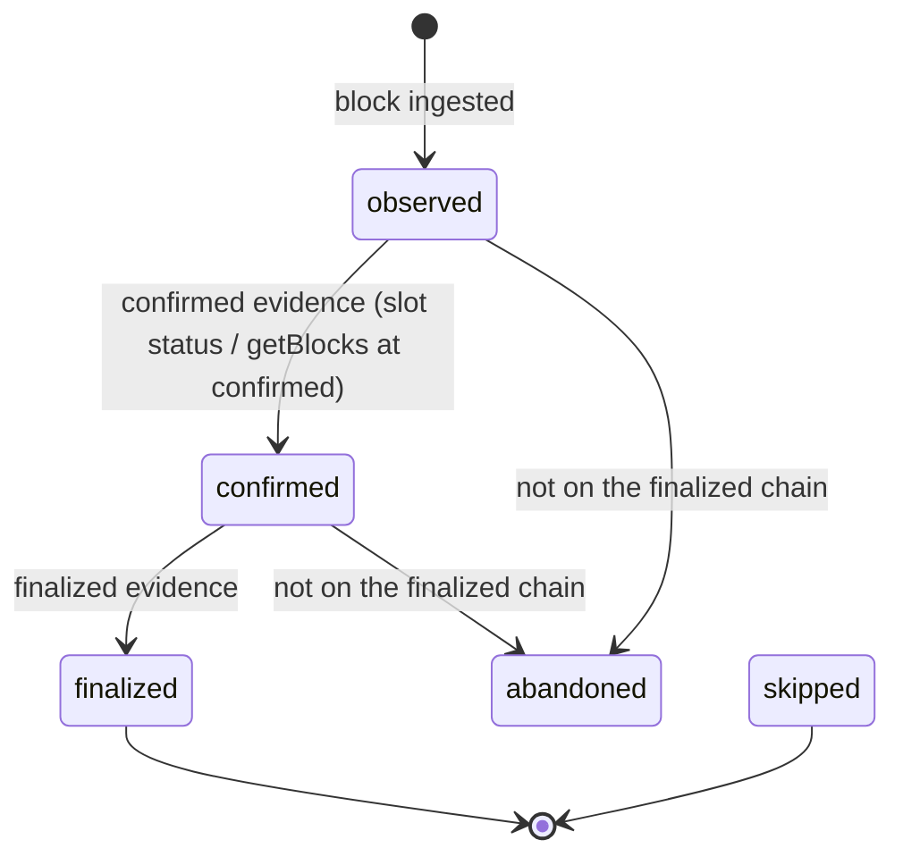

# Sentinel — Commitment, Forks and Finality

**Status: FROZEN (Phase 0). Implementation in Phase 6.**
**Research gate SR-2 (Alpenglow commitment semantics) must be closed before Phase 6.**

> An off-chain observer that does not model forks is not wrong occasionally — it is wrong *silently*.
> This document defines exactly what Sentinel believes at each commitment level, what it will publish,
> and what it does when something it believed turns out never to have happened.

---

## 1. The three levels, and what Sentinel does with each

| Commitment | Meaning | Persisted? | Drives derived state? | Exposed by the API? | Drives execution? |
|---|---|---|---|---|---|
| **`processed`** | The node has the block; it may be on a fork; it may be reverted | **No canonical row.** Ephemeral hint only (in-memory, or Redis with a short TTL) | **No** | Only on an explicitly-labelled `hint` channel, never in a REST resource | Only as a *trigger to re-evaluate*, never as an input to a decision |
| **`confirmed`** | Supermajority-voted; reversion is unlikely but possible | **Yes**, with `commitment='confirmed'` | **Yes**, and every derived row is labelled `confirmed` and is revisable | Yes, labelled | **Yes** — the keeper works from confirmed state, because waiting for finality would make every liquidation late |
| **`finalized`** | Rooted; will not be reverted | **Yes**, promoted in place | Yes, promotes the derived rows | Yes, labelled | Yes — and it is the only level at which Sentinel asserts historical facts |

### 1.1 Why `processed` is never persisted

Persisting `processed` observations would put rows into the canonical store that may correspond to
blocks that never existed on the winning chain, and would require the rollback machinery to run
constantly for no benefit. The only thing `processed` genuinely buys is **latency**, and latency only
matters to the keeper — which re-evaluates against `confirmed` state before it does anything anyway.

So: `processed` is a **wake-up signal**, not a fact. It may set a flag saying "market M may have
changed, look again". It may never be the source of a number.

### 1.2 Why the keeper acts on `confirmed`

Aegis liquidation is competitive and permissionless. Waiting for finality before creating a candidate
would guarantee losing every race and would make the entire keeper pointless. Acting on `confirmed` is
therefore correct — and it is safe because:

- The **chain re-validates everything** at execution time. Aegis checks `HF < WAD` itself; a Sentinel
  candidate based on a reverted block simply fails on-chain with a `RACE_HEALED`-class error.
- The intent's idempotency key prevents a duplicate attempt after the revert.
- The cost of being wrong is one failed transaction's fees, which the budget model accounts for.

This trade is stated explicitly rather than assumed: **Sentinel accepts wasted transaction fees in
exchange for competitive latency, and it measures the waste** (`observability.md` §4,
`fork_wasted_attempts`).

---

## 2. The canonical chain

Sentinel maintains an explicit chain, not a list of slots.

```
slots
  slot              bigint
  blockhash         bytea        -- NULL for skipped slots
  parent_slot       bigint
  parent_blockhash  bytea
  block_time        timestamptz  -- from the block; the only trustworthy time source
  block_height      bigint
  status            enum: skipped | observed | confirmed | finalized | abandoned
  commitment        enum: processed | confirmed | finalized
  first_seen_at     timestamptz
  finalized_at      timestamptz NULL
  PRIMARY KEY (slot, blockhash)
```

**`PRIMARY KEY (slot, blockhash)`, not `(slot)`** — deliberately. A leader can, in principle, produce
two different blocks for the same slot (equivocation), and more commonly Sentinel will observe two
different blocks for one slot from two providers on different forks. Keying on slot alone forces a
lossy choice at insert time; keying on `(slot, blockhash)` records both and lets finality decide.

A slot is **canonical** when it is reachable from the latest finalized slot by following
`parent_blockhash` links. That is computed, stored as a materialized flag, and re-computed on rollback
— never inferred at query time.

---

## 3. Promotion



Rules:

| # | Rule |
|---|---|
| P-1 | Promotion is **monotonic**: `observed → confirmed → finalized`. A level is never lowered. The only non-monotonic transition is to `abandoned`. |
| P-2 | Promotion is driven by **evidence**, not by elapsed time. `getBlocks(commitment=finalized)` over a range, or a `finalized` slot notification, is evidence. A timer is not. |
| P-3 | Promotion is idempotent: re-observing a finalized slot as finalized is a no-op. |
| P-4 | Promotion of a slot promotes the derived rows keyed to it, in one transaction. A slot may not be finalized while state derived from it is still labelled confirmed. |
| P-5 | A slot stuck at `confirmed` beyond a configured deadline is an **alert** (`stalled_finalization`), because it means either the chain is not finalizing or Sentinel's finality evidence path is broken. The deadline is configuration, not a constant — Alpenglow changes it by two orders of magnitude (`ecosystem-research.md` §3). |

---

## 4. Fork detection

Sentinel detects a fork when **the finalized chain does not contain a block it previously recorded**.

```
On advancing the finalized head to slot F:
  1. Walk back from F via parent links to the previous finalized head.
  2. Mark every (slot, blockhash) on that path canonical + finalized.
  3. For every non-finalized (slot, blockhash) with slot ≤ F that is NOT on that path:
        -> ROLLBACK EVENT
```

Additional, earlier signals (useful but never sufficient on their own):

- Two blockhashes observed for one slot (from one provider or two) → suspected fork, watch it.
- A block whose `parent_blockhash` does not match any recorded block at `parent_slot` → a missing
  ancestor; trigger a targeted backfill *before* concluding anything about a fork.

---

## 5. Rollback

```
ROLLBACK(slot_range, abandoned_blockhashes):
  BEGIN
    1. UPDATE slots SET status='abandoned' WHERE (slot,blockhash) IN abandoned set
    2. INSERT rollback_events(detected_at, slot_low, slot_high, abandoned_count, cause)
    3. Mark all normalized rows for those (slot, blockhash) as abandoned  -- NOT deleted
    4. Identify the affected protocol entities:
         markets and positions touched by any abandoned transaction
    5. Enqueue a recompute job per affected entity, scoped to slot_low
    6. Invalidate derived rows for those entities above slot_low
    7. Cancel/flag execution intents whose trigger evidence is now abandoned (§7)
  COMMIT
  -- recompute runs asynchronously; entities are marked RECOMPUTING and the API says so
```

| # | Rule |
|---|---|
| RB-1 | **Nothing is deleted.** Raw rows are immutable; normalized rows are *marked* abandoned. The forensic record of what Sentinel believed and when survives. |
| RB-2 | Recompute is **scoped**, not global. Only entities touched by abandoned transactions are rebuilt, and only from the rollback slot forward. |
| RB-3 | Recompute uses the **same materialization code** as normal operation, replaying the surviving canonical events. There is no special "unwind" path — unwinding by inverting events is how you get sign errors. **Rebuild forward from a known-good point; never subtract.** |
| RB-4 | Affected entities are visibly `RECOMPUTING` in the API until rebuilt, with their last known-good slot. They are never served silently-stale. |
| RB-5 | Every rollback is recorded with its depth and slot range. Rollback depth is a metric with an alert — a deep rollback means either real chain instability or a Sentinel finality bug, and both need a human. |
| RB-6 | Rollback is **serialized** with promotion by the same advisory lock. They must never interleave. |

### 5.1 The known-good point

For a market, the known-good point is the last **finalized** materialization checkpoint. Sentinel
persists a per-entity materialization watermark:

```
materialization_state
  entity_kind    enum: market | position | protocol
  entity_key     text
  last_applied_slot   bigint
  last_finalized_slot bigint      -- rebuild anchor
  status         enum: current | recomputing | stale | unknown_schema
  decoder_version_id  int
```

Rebuild always starts from `last_finalized_slot`, which by definition cannot be rolled back.

---

## 6. Commitment labelling is end to end

**Every** row and **every** API field that derives from chain state carries its commitment. This is not
metadata; it is part of the value.

| Layer | Carries |
|---|---|
| `raw_observations` | `commitment` as received |
| `slots`, `transactions`, `instructions`, `account_observations` | `commitment`, `canonical` |
| Protocol entities | `as_of_slot`, `as_of_commitment` |
| Derived (health, candidates) | `computed_at_slot`, `commitment`, `t_eval` |
| REST responses | `meta.commitment`, `meta.as_of_slot`, `meta.as_of_block_time`, `meta.chain_head_slot`, `meta.lag_slots` |
| WebSocket messages | `commitment` per message, plus a `revision` message type when a prior value is superseded by rollback |

**Rule (NFR-2):** a value without a commitment label is a bug, not an omission. The API type system
makes it impossible to construct a chain-derived response without one.

### 6.1 Revisions on the realtime channel

When a rollback invalidates a value a client was already told, the WebSocket emits an explicit
`revision` message naming the entity, the superseded slot, and the new value (or `RECOMPUTING`).
Clients are never left holding a value Sentinel knows is wrong.

---

## 7. Forks and execution

This is where a fork can cost real money, so the rules are specific.

| Situation | Behavior |
|---|---|
| An intent's **trigger evidence** is abandoned before any attempt was signed | Cancel the intent with reason `TRIGGER_ROLLED_BACK`. Nothing was spent. |
| An intent has a **signed but unsubmitted** attempt when the trigger is abandoned | Do not submit. Mark the attempt `ABANDONED_PRE_SUBMIT`. The signature exists but was never broadcast; record it so a later observation of that signature (someone else could rebroadcast it) is attributable. |
| An intent has a **submitted** attempt when the trigger is abandoned | **Do not create a new attempt.** Let the existing one resolve. On Solana a transaction is only valid while its blockhash is; the outcome is bounded by `lastValidBlockHeight`. See `transaction-engine.md` §8. |
| An attempt was **observed as confirmed**, then that slot is abandoned | The transaction did not happen on the winning chain. The attempt returns to `SUBMITTED`, and resolution continues from `lastValidBlockHeight`. It may still land in a later slot — Solana transactions are not fork-bound, only blockhash-bound. **This is the single subtlest case in the system** and has a dedicated failure-injection test. |
| An attempt was **finalized** | Terminal. Finalized transactions do not un-happen. |

**Rule E-F1:** the keeper never treats `confirmed` execution as final for the purpose of *not*
retrying. It treats it as final only for the purpose of *not* creating a second intent — which is
already guaranteed by the idempotency key.

**Rule E-F2:** the economically dangerous direction is doing something *twice*, not doing it *late*.
Every ambiguity in this table resolves toward waiting.

---

## 8. What the UI and API may say

| State | Permitted presentation | Forbidden |
|---|---|---|
| `processed` | "pending" on an explicitly ephemeral channel | Any REST resource; any number a user might act on |
| `confirmed` | The value, with a visible `confirmed` label and the lag in slots and seconds | Presenting it as final; omitting the label |
| `finalized` | The value, labelled `finalized` | — |
| `RECOMPUTING` | "recomputing after a chain reorganisation", with the last known-good slot | Serving the pre-rollback value as if current |
| `UNKNOWN` health (no valid oracle) | "unknown — oracle unavailable", with which check failed | Defaulting to "healthy" |
| Sentinel lagging beyond threshold | A degraded banner with the lag figure | Serving stale data silently |

**Rule:** *degraded and honest* beats *fresh-looking and wrong*. Every degradation has a visible
representation, and the API has a machine-readable `meta.degraded` with a reason code so a programmatic
consumer can make its own decision.

---

## 9. Skipped slots, duplicates, and out-of-order arrival

| Phenomenon | Handling |
|---|---|
| **Skipped slot** | Normal. Recorded as `status='skipped'`, satisfies contiguity, is not a gap, never triggers backfill. |
| **Duplicate notification** | Idempotent at the raw layer; no effect. |
| **Two blockhashes at one slot** | Both stored (§2). Finality decides. If both are non-canonical, both are abandoned. |
| **Account update arrives before the transaction that caused it** | Expected and fine. Account observations are keyed by `(pubkey, slot, content_hash)` and are joined to transactions by slot, not by arrival. Materialization is driven by the **event projection ordered by `(slot, tx_index, ix_index)`**, so arrival order is irrelevant. |
| **Transaction observed at a slot below the materialization watermark** | Late arrival from a gap repair. The affected entity is re-materialized from its `last_finalized_slot`, not patched in place. |
| **A block arrives whose parent is unknown** | Do not conclude a fork. Backfill the ancestor first, then re-evaluate. A missing ancestor is far more often a gap than a fork. |

---

## 10. Invariants

| ID | Invariant | Checked by |
|---|---|---|
| CHN-01 | Commitment is monotonic per `(slot, blockhash)` except for the transition to `abandoned` | Property test over random promotion orders |
| CHN-02 | Every canonical slot is reachable from the finalized head by parent links | Continuous assertion + test |
| CHN-03 | No derived row is labelled `finalized` while any input it depends on is not | Schema constraint + test |
| CHN-04 | A rollback never deletes a raw or normalized row | DB permissions + test |
| CHN-05 | Recompute after rollback produces the same state as a full replay of the surviving chain | Determinism test (`replay-and-backfill.md` §7) |
| CHN-06 | No execution intent is created twice for the same trigger across a rollback and re-observation | Idempotency key + failure-injection test |
| CHN-07 | Every API response derived from chain state carries a commitment label | Type-level + contract test |
| CHN-08 | Promotion and rollback never interleave | Advisory lock + concurrency test |
| CHN-09 | A slot marked skipped is never later given a block without an explicit correction event | Test |
| CHN-10 | No duration anywhere in the codebase is computed from a slot count | CI grep (`CI-NOSLOTTIME`) |
