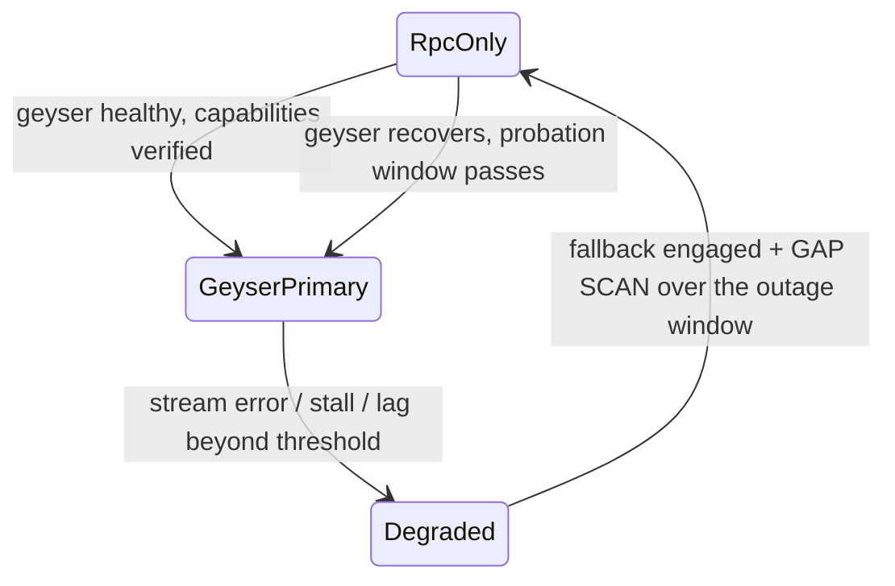

# Sentinel — Optional Geyser / Yellowstone Path

**Status: FROZEN (Phase 0). Implementation in Phase 13 — OPTIONAL.**
**Research gate SR-3 must be closed before implementation.**

> **The rule this document exists to enforce:** Sentinel's correctness model is *identical* with and
> without Geyser. Geyser changes latency and event volume, never truth. If adopting it required
> changing a single correctness argument, that would be evidence the RPC design was wrong.

---

## 1. What bottleneck it actually solves

| Problem | Does Geyser solve it? |
|---|---|
| **Notification loss under load.** Agave's native PubSub runs subscription processing on a single worker thread by default and drops messages under load. | **Yes.** The plugin taps the validator's internal notification path rather than the PubSub server. |
| **Latency.** RPC WebSocket adds a hop and a serialization layer. | **Yes**, meaningfully — and it is the difference between winning and losing a liquidation race. |
| **Account-update volume.** Sentinel cannot `accountSubscribe` to thousands of positions individually. | **Yes.** Server-side filtering by owner program yields every Aegis account in one stream. |
| **No `blockSubscribe`.** The RPC firehose is documented unstable. | **Yes.** A stable block/transaction stream exists. |
| **Gaps.** | **No.** A stream is still a stream; it can still disconnect. Gap detection and slot-range reconciliation remain mandatory. |
| **Forks.** | **No.** Commitment promotion and rollback are unchanged. |
| **Completeness.** | **No.** HTTP range reconciliation remains the authority. |

**Conclusion:** Geyser is a **latency and volume** optimization. Every correctness mechanism in
`ingestion-model.md` and `finality-and-forks.md` stays exactly as it is. That is why it is Phase 13 and
not Phase 4.

---

## 2. Is it necessary for Aegis? Honestly: no.

- Aegis is a **single program with a small, bounded account set** — one `Protocol`, N markets, M
  positions, 2N vaults. This is not a high-cardinality indexing problem.
- Aegis markets are isolated and contention-bounded by design; transaction volume per market is low.
- Every Aegis instruction fits a legacy transaction; blocks containing Aegis activity are ordinary.

**Adoption trigger, stated as a measurement, not a preference:** Geyser is implemented only when the
Phase 14 campaign shows **either**

1. `ingest_lag_seconds` p95 exceeds its target with the RPC path already tuned (batching, provider
   pool, priorities correct), **or**
2. `keeper_detection_latency` p95 is dominated by ingestion rather than by evaluation, **and** a
   measured loss rate to competing liquidators is above the stated threshold.

Absent one of those, implementing Geyser would be exactly the CV-driven architecture `AGENTS.md` §14
forbids — and the coverage matrix says so plainly.

---

## 3. The interface is already the interface

`YellowstoneSource` implements the same `ObservationSource` trait as `RpcWsSource`
(`ingestion-model.md` §2). Nothing downstream changes:

| Downstream stage | Change required |
|---|---|
| Raw observation writer | **None.** `source = 'geyser'` on the row. |
| Natural keys | **None**, with one enrichment: Geyser reports `write_version`, so account observations can key on `(pubkey, slot, write_version)` instead of a content hash. Both are supported; the source's capability decides. |
| Normalization | **None.** |
| Chain state / promotion / rollback | **None.** |
| Decode / materialize / risk | **None.** |
| Gap detection | **None** — still slot-range reconciliation over HTTP. |
| Tests | **None on the required path** — no required test may use Geyser. |

The only genuinely new code is the adapter: connect, subscribe with filters, map protobuf messages onto
`Observation`, and handle reconnect.

---

## 4. Subscription design

Yellowstone exposes filtered streams for slots, accounts, transactions, blocks, and entries, across
`processed / confirmed / finalized`.

| Stream | Filter | Purpose |
|---|---|---|
| Slots | commitment: confirmed + finalized | Head tracking and promotion evidence |
| Accounts | `owner = <aegis program>` | **The big win** — every Aegis account update without per-account subscriptions |
| Accounts | `owner = <pyth receiver program>` | Price update accounts, whose addresses are ephemeral and cannot be pre-subscribed |
| Transactions | `account_include = <aegis program>`, `vote = false`, `failed = true` | Aegis activity including failures, which matter for reconciliation |
| Blocks | as needed | Only if measurement shows the transaction stream is insufficient |
| Entries | — | **Not used.** No product reason. |

Note the account streams are exactly the two cases RPC handles badly: too many accounts to subscribe
individually, and accounts whose addresses are not known in advance.

---

## 5. Failure and fallback

| # | Rule |
|---|---|
| GY-1 | The RPC WebSocket path stays **configured and warm** whenever Geyser is primary. Fallback is a switch, not a cold start. |
| GY-2 | Every transition **either way** triggers a gap scan over the transition window. Duplicate observations are free (raw `DO NOTHING`); a gap is not. |
| GY-3 | Geyser lag is measured against the HTTP head independently, so "the stream is quiet" is distinguishable from "nothing is happening". |
| GY-4 | **Assume no replay/resume.** No consulted source documented resume-from-slot (SR-3). Recovery is the same slot-range reconciliation as everywhere else — which is why it costs nothing to assume the worst here. |
| GY-5 | Flapping between sources is damped by a probation window before Geyser is re-promoted. |
| GY-6 | Losing Geyser entirely is a **degradation, never an outage**. Alert severity reflects that. |

---

## 6. Zero-cost path

Geyser is self-hostable and free: build the plugin, write `geyser-config.json`, run
`agave-validator --geyser-plugin-config` (`ecosystem-research.md` §5).

| # | Rule |
|---|---|
| ZC-1 | **No required test uses Geyser**, and `make test` passes with the crate absent (feature-gated). |
| ZC-2 | The local Geyser path uses a **self-hosted validator + plugin**, never a hosted provider. |
| ZC-3 | A hosted Yellowstone endpoint is an optional, network-tagged tier excluded from `make test`, exactly like Aegis's optional Jupiter tier. |
| ZC-4 | The demo does **not** require Geyser. If a claim in the README depends on it, either the claim is wrong or the tier is misclassified. |
| ZC-5 | The Geyser-enabled local setup is documented but is **not** part of `make up` — it requires building a validator plugin, which is a heavier local dependency than the required path is allowed to have. |

---

## 7. Operational cost — stated honestly

| Cost | Detail |
|---|---|
| Self-hosting | Running a validator is materially heavier than running Surfpool: disk, snapshot management, and catch-up time. Real, and the reason the required path does not use it. |
| Hosted | A paid subscription. Excluded from every required path (ADR-0013). |
| Version coupling | The plugin is coupled to the validator's internal plugin interface; a validator upgrade can require a plugin upgrade. That is an operational burden RPC does not have, and it is a genuine argument for keeping Geyser optional. |
| Compatibility uncertainty | Whether stock Agave suffices or a patched fork is required is **unresolved** (SR-3) and must be closed before Phase 13 starts. |

---

## 8. Acceptance criteria (Phase 13)

| ID | Criterion |
|---|---|
| GS-01 | `YellowstoneSource` implements `ObservationSource` with **no** change to any downstream stage |
| GS-02 | Over the same slot range, the two sources produce **identical** `transactions`, `instructions`, `program_logs`, `token_balance_deltas`, protocol entities, and derived state (digest comparison). **`account_observations` are compared by *final decoded state per (pubkey, slot)*, not by row count** — Geyser reports `write_version` and can legitimately emit more intermediate observations than RPC. A row-count comparison there would fail for a correct implementation; a final-state comparison is the property that actually matters. |
| GS-03 | Killing the Geyser stream mid-ingestion triggers fallback plus a gap scan, and no data is lost |
| GS-04 | `make test` passes with the Geyser feature disabled and the crate absent |
| GS-05 | A measured before/after of `ingest_lag_seconds` and `keeper_detection_latency`, committed as benchmark evidence |
| GS-06 | SR-3 closed: versions, stock-Agave compatibility, and resume semantics documented from primary sources |
| GS-07 | The local self-hosted setup is reproducible from documentation, with no paid service |
