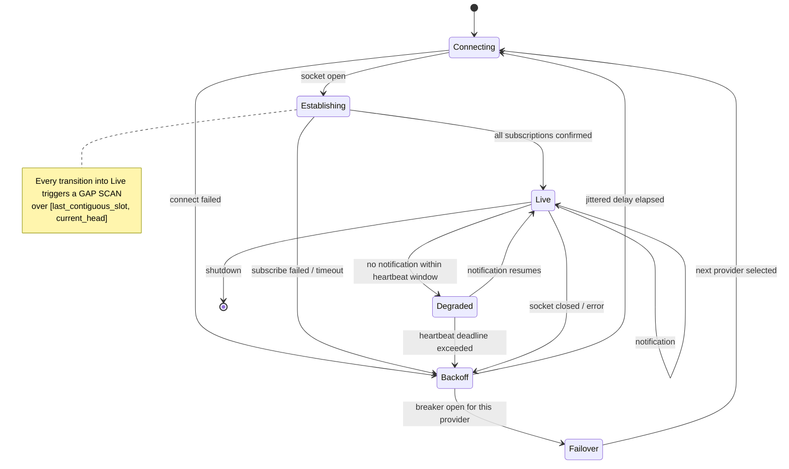

# Sentinel — Ingestion Model

**Status: FROZEN (Phase 0). Implementation in Phases 3–5.**

> **The governing sentence of this document:** *the WebSocket tells Sentinel when to look; HTTP tells
> Sentinel what is true.* Every low-latency path has a slower, complete counterpart, and the two
> reconcile. Nothing in Sentinel treats a push notification as evidence of completeness.

---

## 1. Delivery assumptions — stated before anything is designed

| Assumption | Justification | Consequence |
|---|---|---|
| Delivery is **at-least-once**, never exactly-once | Reconnects re-deliver; backfill overlaps realtime; providers duplicate | Every write is idempotent under a natural key |
| Notifications **can be lost** | Agave's native PubSub drops messages under load (`ecosystem-research.md` §4) | Completeness comes from slot-range reconciliation, not from the stream |
| Subscriptions **do not survive reconnect** | Verified behavior | The connection manager re-establishes a declarative subscription set on every connect |
| Ordering is guaranteed **only within one subscription on one connection** | Independent streams, independent providers | Ordering is established by `(slot, transaction_index, instruction_index)` from the data, never by arrival order |
| An account update **is not emitted unless the account changed** | Agave 4.2 (`ecosystem-research.md` §1.1) | Absence of an update means "no change", never "missed"; account state is a reconciliation input, not the primary path |
| A provider **can be wrong or behind** | Different nodes, different forks, different snapshots | Every observation records its provider; divergence is detected, not averaged |
| A slot **can disappear** | Forks | See `finality-and-forks.md` |

---

## 2. Observation sources

All sources implement one Rust trait, which is what makes Geyser optional rather than structural:

```rust
/// A source of chain observations. Implementations: RpcHttpSource, RpcWsSource,
/// YellowstoneSource (Phase 13), FixtureSource (tests).
trait ObservationSource {
    /// Push-style: yields observations as they arrive. May lose messages.
    fn stream(&self, sub: SubscriptionSet) -> impl Stream<Item = Result<Observation>>;

    /// Pull-style: authoritative for a bounded slot range. Must be complete or error.
    async fn fetch_range(&self, range: SlotRange, opts: FetchOpts) -> Result<Vec<Observation>>;

    fn capabilities(&self) -> SourceCapabilities;  // what this source can actually do
}
```

`SourceCapabilities` is discovered, not assumed: whether the source supports historical fetch, which
commitments it exposes, whether it filters votes, its maximum range per call, and whether it reports
`write_version` for account updates. A capability a source lacks is a **compile-time-visible `None`**,
not a runtime surprise.

| Source | Kind | Required path? | Provides |
|---|---|---|---|
| `RpcHttpSource` | pull | **Yes** | `getBlock`, `getBlocks`, `getTransaction`, `getSignaturesForAddress`, `getMultipleAccounts`, `getProgramAccounts`, `getSlot`, `getBlockHeight`, `getLatestBlockhash`, `getRecentPrioritizationFees`, `simulateTransaction` |
| `RpcWsSource` | push | **Yes** | `slotSubscribe`, `accountSubscribe`, `logsSubscribe`, `signatureSubscribe` |
| `YellowstoneSource` | push | **No — Phase 13** | slots, accounts, transactions, blocks, entries with server-side filters |
| `FixtureSource` | pull+push | tests only | deterministic replay of committed fixtures |

**`blockSubscribe` is not used in any required path** — documented unstable, extra validator flags, and
drops under volume (`ecosystem-research.md` §4).

---

## 3. What is ingested

| Stream | Primary source | Latency source | Natural key |
|---|---|---|---|
| **Slots** | `getBlocks(start, end)` for existence; `getBlock` for content | `slotSubscribe` | `slot` |
| **Blocks** | `getBlock(slot, {maxSupportedTransactionVersion, rewards, transactionDetails})` | — | `(slot, blockhash)` |
| **Transactions** | inside the block | `logsSubscribe` (signature only) | `(signature, slot, blockhash)` |
| **Instructions** | parsed from the transaction message + `meta.innerInstructions` | — | `(signature, slot, ix_index, inner_index)` |
| **Program logs** | `meta.logMessages` from the block | `logsSubscribe` | `(signature, slot, log_index)` |
| **Token balance deltas** | `meta.pre/postTokenBalances` | — | `(signature, slot, account_index)` |
| **Account states** | `getMultipleAccounts` / `getProgramAccounts` (scheduled) | `accountSubscribe` | `(pubkey, slot, content_hash)` |
| **Oracle price updates** | receiver-program transactions + account reads | `accountSubscribe` on discovered accounts | `(feed_id, publish_time, slot)` |

### 3.1 Why the block is the unit of ingestion

Sentinel ingests **whole blocks**, not individual transactions, on the completeness path. A block is:

- **Self-delimiting**: it either fully arrives or errors, so partial state is impossible.
- **Ordered**: transaction index within the block gives a total order Sentinel does not have to invent.
- **Attributable**: it carries the blockhash and parent slot, which is exactly what the chain-state
  engine needs to build the canonical chain.
- **Complete for logs and token balances**, which the WebSocket paths are not.

`getSignaturesForAddress` is used only for **targeted backfill of one program's history** (bootstrap
and gap repair for the Aegis program specifically), never as the primary ingestion loop — it is
address-scoped and cannot establish slot completeness.

### 3.2 Mandatory call parameters

Every historical fetch call site sets, without exception:

```
maxSupportedTransactionVersion: <configured, currently 0; raise when v1 activates>   // else -32015 on v1 blocks
commitment:                     <explicit — never the provider default>
minContextSlot:                 <where supported, to reject a node that is behind>
encoding:                       "base64" for account data;  "json" for block structure
transactionDetails:             "full"
rewards:                        false unless the reward stream is being ingested
```

A missing `maxSupportedTransactionVersion` is threat **S-04** and has a required test.

---

## 4. WebSocket lifecycle



Rules:

| # | Rule |
|---|---|
| W-1 | The subscription set is **declarative state**, owned by the connection manager and re-applied on every connect. Sentinel never assumes a subscription survived. |
| W-2 | **Every** transition into `Live` triggers a gap scan. Not just after an error — also after a clean restart, because the socket may have been down for an unknown interval. |
| W-3 | Liveness is a **heartbeat on slot notifications**, with the window derived from observed slot times (§ NFR-14), never from a hardcoded 400ms. A quiet `accountSubscribe` proves nothing (Agave 4.2 suppression). |
| W-4 | Backoff is exponential with **full jitter** and a hard ceiling. Unthrottled reconnection is a self-inflicted outage. |
| W-5 | Reconnect count, time-to-live, and per-provider disconnect reason are metrics with alerts. |
| W-6 | A notification is **never** written to a canonical table directly. It is written to raw, and it triggers the pull path that establishes truth. |

---

## 5. The raw observation boundary

**Every** observation crosses this boundary before anything else touches it (ADR-0008).

```
raw_observations
  observation_id   bigserial PK
  kind             enum: block | transaction | account | log_batch | slot_status
                       | program_accounts_page | signature_status | oracle_update
  natural_key      text NOT NULL      -- kind-specific; see §5.1
  slot             bigint             -- best-known slot association (may be NULL for slot_status)
  commitment       enum: processed | confirmed | finalized
  source           enum: rpc_http | rpc_ws | geyser | fixture
  provider_id      text NOT NULL      -- which endpoint produced this
  request_id       uuid               -- correlates to the RPC call that fetched it
  observed_at      timestamptz NOT NULL DEFAULT now()
  payload          bytea NOT NULL     -- exact bytes as received, compressed
  payload_hash     bytea NOT NULL     -- sha256 of payload, pre-compression
  payload_encoding enum: json_zstd | borsh | base64_raw

  UNIQUE (kind, natural_key, payload_hash)
```

### 5.1 Natural keys per kind

| Kind | `natural_key` |
|---|---|
| `block` | `{slot}:{blockhash}` |
| `transaction` | `{signature}:{slot}` |
| `account` | `{pubkey}:{slot}:{content_hash}` |
| `log_batch` | `{signature}:{slot}` |
| `slot_status` | `{slot}:{status}` |
| `program_accounts_page` | `{program_id}:{slot}:{page_index}` |
| `signature_status` | `{signature}:{slot_observed}` |
| `oracle_update` | `{feed_id}:{publish_time}:{slot}` |

### 5.2 Rules

| # | Rule | Rationale |
|---|---|---|
| R-1 | **Append-only.** No `UPDATE`, no `DELETE` from application code. Enforced by the database role used by every writer. | Immutability is the replay guarantee. |
| R-2 | Insert with `ON CONFLICT (kind, natural_key, payload_hash) DO NOTHING`. | Duplicate delivery is free. |
| R-3 | **Payload-hash in the uniqueness key is deliberate.** Two providers returning *different bytes* for the same key both get stored. That is the divergence-detection mechanism (§10). | Averaging or last-write-wins would destroy the evidence. |
| R-4 | Payload is stored **as received**, before any interpretation. | Forensics. A decoder bug must be diagnosable from the bytes. |
| R-5 | Payload size is bounded before storage; an oversized payload is rejected with a `decode_failures` row naming the size. | DoS via oversized input (`threat-model.md` S-11). |
| R-6 | Only `sentinel-ingest` writes this table. | One writer, one invariant. |

---

## 6. Checkpoints

```
ingest_checkpoints
  stream_name          text PK    -- 'slots', 'aegis_program_history', 'oracle_feeds', ...
  last_contiguous_slot bigint     -- every slot ≤ this is ingested and gap-free
  head_slot            bigint     -- highest slot observed, may be ahead with gaps between
  commitment           enum
  updated_at           timestamptz
  holder               text       -- advisory-lock owner, for the indexer singleton
```

Rules:

| # | Rule |
|---|---|
| C-1 | `last_contiguous_slot` advances **only** when every slot up to it is present or provably skipped. It is a watermark, not a cursor. |
| C-2 | The checkpoint is advanced **in the same database transaction** as the raw insert(s) it covers. |
| C-3 | The checkpoint is advanced **after** the data, never before. A crash therefore re-delivers (safe, idempotent), never skips (unsafe). |
| C-4 | `head_slot` may run ahead of `last_contiguous_slot`. The distance between them is the **gap backlog** and is a first-class metric. |
| C-5 | A skipped slot on Solana is normal. It is recorded as `slot_status = skipped` and satisfies contiguity — it is not a gap. |

---

## 7. Gap detection

A **gap** is a slot in `[last_contiguous_slot + 1, head_slot]` that is neither ingested nor recorded as
skipped.

```
1. Every N seconds, and on every WebSocket transition into Live:
2.   window = [last_contiguous_slot + 1, min(head_slot, last_contiguous_slot + MAX_SCAN)]
3.   present = getBlocks(window.start, window.end)         -- authoritative slot list for the range
4.   missing = window \ present \ already_ingested
5.   for each contiguous run in missing:  enqueue a backfill job (bounded size)
6.   for each slot in (window \ present): record slot_status = skipped
7.   advance last_contiguous_slot over the now-complete prefix
```

| # | Rule |
|---|---|
| G-1 | `getBlocks` over a bounded range is the **authoritative** answer to "which slots produced a block". Absence from the stream is not evidence. |
| G-2 | Scans are bounded (`MAX_SCAN`) so a long outage produces many bounded jobs rather than one unbounded query. |
| G-3 | Every gap is **recorded** — `gap_events(slot_start, slot_end, detected_at, repaired_at, cause)` — so gap rate and repair latency are measurable, not anecdotal. |
| G-4 | An unrepaired gap older than a configured age is an **alert**, because every downstream correctness claim depends on contiguity. |
| G-5 | Gap repair uses the **pull** path exclusively, and may target a different provider than the one that lost the notification. |

---

## 8. Backfill

Backfill and realtime ingestion are **the same code path** with a different slot range. There is no
separate "historical" pipeline to drift from the live one.

| # | Rule |
|---|---|
| B-1 | Backfill writes the same raw rows with the same natural keys and the same `ON CONFLICT DO NOTHING`. **Overlap with realtime is therefore a no-op, by construction.** |
| B-2 | Backfill jobs are range-partitioned and claimed by lease, so multiple workers process **disjoint** ranges concurrently. |
| B-3 | Backfill **never** advances `last_contiguous_slot` directly. It fills raw; the gap scanner advances the watermark when contiguity is achieved. This keeps one authority for the watermark. |
| B-4 | Backfill is rate-limited independently of realtime, and yields to realtime under provider pressure. Falling behind the head is worse than backfilling slowly. |
| B-5 | A backfill range that fails repeatedly is quarantined with its error, not retried forever (`distributed-correctness.md` §7). |

See `replay-and-backfill.md` for replay (re-deriving from existing raw) as distinct from backfill
(fetching raw Sentinel never had).

---

## 9. Deduplication and idempotency

Three layers, deliberately redundant:

1. **Raw layer:** `UNIQUE (kind, natural_key, payload_hash)` with `DO NOTHING`.
2. **Normalized layer:** every table has a natural key with an explicit conflict policy — `DO NOTHING`
   for immutable facts (a transaction's content), `DO UPDATE` only where a field is legitimately
   revisable (a slot's commitment level, a block's canonical flag).
3. **Effect layer:** externally visible effects are guarded by `execution_intents.idempotency_key`
   (`transaction-engine.md` §3).

**Rule:** a consumer that cannot state its natural key and its conflict policy is not finished.
This is checked in review and encoded in `data-model.md` §3–7.

---

## 10. Provider divergence

Because two providers' payloads for the same natural key are both stored (R-3), divergence is
*detectable* rather than silently resolved.

```
1. A background reconciler samples natural keys observed from ≥2 providers.
2. For `block`, it compares blockhash and transaction-signature set.
3. Divergence classes:
   a. TRANSIENT_LAG      — one provider had not yet seen the block. Resolves on retry.
   b. FORK_DIVERGENCE    — different blockhash for the same slot. Real; resolved by finality.
   c. CONTENT_DIVERGENCE — same blockhash, different content. A provider is faulty or lying.
4. Policy:
   - TRANSIENT_LAG:      no action; counted.
   - FORK_DIVERGENCE:    hand to the chain-state engine; the finalized chain decides.
   - CONTENT_DIVERGENCE: ALERT, mark the provider degraded, exclude it from the pool,
                         and never merge the payloads.
```

**Sentinel never votes, averages, or picks a majority.** For a fork, finality decides. For content
divergence, one provider is wrong and continuing to use it is the bug.

---

## 11. Malformed and unknown data

| Situation | Behavior |
|---|---|
| Payload exceeds the size bound | Reject before parsing; `decode_failures` row with the observed size; count toward provider health |
| JSON does not parse | `decode_failures` row referencing the raw observation; **worker continues** |
| A field has an unexpected type | Same |
| **An enum has an unrecognized variant** | **Store the raw value, count it, continue.** Never drop the record. (Agave 4.2's `DeactivatedStake` is the concrete example.) |
| An account has an unknown discriminator | `UNKNOWN_SCHEMA`; entity marked stale; alert (`aegis-integration.md` §8.3) |
| A transaction fails to parse | `decode_failures`; the block's other transactions still normalize |
| A whole block fails to parse | `decode_failures` for the block; the slot is **not** marked ingested, so the gap scanner retries it — possibly against a different provider |

**Rules:**
- **A malformed input must never terminate a worker.** No `unwrap`, `expect`, `panic!`, or index-out-of
  -bounds on any path touching external data. Clippy-enforced, and tested with a deliberately corrupt
  fixture corpus (`testing-strategy.md` §6).
- **Every decode failure keeps a pointer to the raw observation**, so a later decoder fix can replay
  exactly the failing inputs.
- **Decode-failure rate is a metric with an alert.** A sudden rise is how a schema change announces
  itself.

---

## 12. Concurrency model

| Concern | Decision |
|---|---|
| Realtime ingestion | **Singleton** per chain, guarded by a Postgres advisory lock on the checkpoint row. Simplest correct answer at this scale; the sharding seam is documented in `performance-strategy.md` §7. |
| Backfill / replay | Horizontally parallel over **disjoint, leased slot ranges**. |
| Normalization | Parallel over blocks; ordering within a block comes from the data, not the scheduler. |
| Chain-state engine | **Serialized per chain.** Commitment promotion and fork resolution must see a total order. Guarded by an advisory lock. |
| Decoding / materialization | Parallel over **markets**, serialized within a market — mirroring Aegis's own contention model (`account-model.md` §8), which is a genuinely useful alignment. |
| Risk evaluation | Parallel over positions; read-only against materialized state at a pinned slot. |
| Backpressure | Every stage has a bounded channel and a bounded in-flight count. When the raw writer saturates, the WebSocket reader **drops to counting** rather than buffering unboundedly — a deliberate gap that the gap scanner repairs, which is strictly better than an OOM. |

The last row is the important one: **Sentinel prefers a recorded, repairable gap over unbounded memory
growth.** That is only a safe preference because the gap scanner exists and is tested.

---

## 13. Rate limits and provider pressure

- Every provider has a configured request budget (per second and concurrent), enforced client-side
  before the request is made — never discovered by receiving a 429.
- A 429 or a `Retry-After` immediately reduces the local budget for that provider and counts toward its
  breaker.
- Priority classes, highest first: **execution** (simulate/submit/status) > **realtime completeness**
  (head blocks) > **gap repair** > **backfill** > **scheduled scans** (`getProgramAccounts`).
  Under pressure, low-priority classes starve first, by design.
- `getProgramAccounts` is expensive and is treated as a scheduled, rate-limited, lowest-priority
  operation with a configured minimum interval — never on any hot path.

---

## 14. Ingestion invariants

| ID | Invariant | Checked by |
|---|---|---|
| ING-01 | Every normalized row traces to at least one raw observation | FK + replay test |
| ING-02 | No raw row is ever updated or deleted by application code | DB role permissions + test |
| ING-03 | A checkpoint never advances past a slot whose data is not durably persisted | Crash-injection test |
| ING-04 | Duplicate delivery of an identical payload creates no second row and no second effect | Property test |
| ING-05 | Every slot in `[first_ingested, last_contiguous]` is present or recorded skipped | Continuous assertion + test |
| ING-06 | Every gap detected is either repaired or visible as an unrepaired alert | Failure-injection test |
| ING-07 | A malformed payload produces exactly one `decode_failures` row and no worker restart | Corrupt-fixture test |
| ING-08 | Backfill overlapping realtime produces zero duplicate rows | Overlap test |
| ING-09 | Every observation records its provider, source, commitment, and receipt time | Schema `NOT NULL` |
| ING-10 | Divergent payloads from two providers are both retained and flagged, never merged | Divergence test |
