# Sentinel — Aegis Liquidation Keeper

**Status: FROZEN (Phase 0). Implementation in Phase 11.**
**Upstream dependency: Aegis Phase 6 (liquidation) and Phase 9 (`@aegis/sdk`).**

> The keeper is the closed loop that makes every correctness claim in this repository falsifiable: the
> chain grades Sentinel's homework, transaction by transaction.

---

## 1. The loop

```mermaid
flowchart LR
    A["oracle update / Aegis state change"] --> B["ingest (raw)"]
    B --> C["normalize + chain state"]
    C --> D["decode Aegis events + snapshots"]
    D --> E["materialize market + position"]
    E --> F["accrue_view to t_eval<br/>compute HF via aegis-math"]
    F --> G{"HF < WAD ?"}
    G -->|no| Z["record health, done"]
    G -->|yes| H["size: close factor,<br/>full_liq_hf, dust rule"]
    H --> I{"profitable ?"}
    I -->|no| Y["record candidate, unprofitable, do not act"]
    I -->|yes| J["candidate + execution intent<br/>(idempotency key)"]
    J --> K["claim, re-read state, re-evaluate at t_eval"]
    K --> L["build via @aegis/sdk<br/>resolve fresh Pyth accounts"]
    L --> M["simulate (mandatory)"]
    M --> N["policy check on final bytes"]
    N --> O["sign -> PERSIST -> submit"]
    O --> P["track: observed -> confirmed -> finalized"]
    P --> Q["ingest the resulting Aegis state"]
    Q --> R["reconcile prediction vs outcome"]
    R --> S["publish realtime result"]
```



Steps K through P are the transaction engine (`transaction-engine.md`); this document specifies the
Aegis-specific parts and, more importantly, everything that goes wrong.

---

## 2. Detection

### 2.1 The working set

Only positions that can be liquidated are evaluated:

```sql
SELECT ... FROM aegis_positions
 WHERE is_open AND borrow_shares > 0
   AND status = 'current'
   AND market_pubkey IN (SELECT market_pubkey FROM aegis_markets
                          WHERE status='current' AND NOT liquidate_paused)
```

This is the index `(market_pubkey, borrow_shares) WHERE borrow_shares > 0` from `data-model.md` §5.

### 2.2 Evaluation triggers

Evaluation is **event-driven with a periodic floor**, never a pure poll:

| Trigger | Scope |
|---|---|
| A new valid oracle observation for a feed | Every position in every market using that feed |
| An Aegis event that changes a position (`Borrowed`, `CollateralWithdrawn`, `Repaid`, `CollateralDeposited`, `Liquidated`) | That position |
| An Aegis event that changes market totals (`InterestAccrued`, `Supplied`, `Withdrawn`, `BadDebtAbsorbed`) | Every position with debt in that market |
| `MarketParamsUpdated` | Every position in that market |
| Periodic floor (configured interval) | Everything with debt |

The periodic floor exists because **debt accrues with time alone**: a position can cross `HF < WAD`
with no on-chain event at all. A purely event-driven keeper would miss exactly the positions that
decayed quietly, which is a large fraction of real liquidations.

### 2.3 Evaluation

Exactly the sequence in `aegis-integration.md` §5, with `t_eval = now + expected_landing_latency`.

`expected_landing_latency` is **measured**, not assumed: it is the observed p95 from
`transaction_attempts` (`signed_at` → `observed_at`), with a configured floor and ceiling, and it is
recorded on the candidate. Using a guessed constant here is how a keeper systematically evaluates at the
wrong time.

---

## 3. Sizing and profitability

### 3.1 Sizing — from Aegis's frozen rules, not invented

```
debt_assets = to_assets_up(borrow_shares, accrued_total_borrow_assets, total_borrow_shares)

max_repay = (HF < full_liq_hf) ? debt_assets
                               : floor(debt_assets · close_factor / WAD)

// dust rule: never leave 0 < remaining < min_debt
if (debt_assets − max_repay) > 0 and (debt_assets − max_repay) < min_debt:
    max_repay = debt_assets
```

Then seizure, bonus, protocol cut, and the **collateral clamp** exactly per
`aegis/economic-model.md` §7.2–7.3. The clamp path (`total_seize > collateral_amount`) recomputes the
repayment **upward-rounded** — the liquidator pays more, never less. Getting that direction backwards
produces a transaction Aegis rejects.

### 3.2 Profitability

```
proceeds_value = to_liquidator × price_c_lo / 10^collateral_decimals      // what we receive
cost_value     = repay_assets  × price_l_hi / 10^loan_decimals            // what we pay
gross_margin   = proceeds_value − cost_value
net_margin     = gross_margin − tx_fee_value − priority_fee_value
                              − expected_slippage_value − inventory_cost_value
profitable     = net_margin ≥ min_profit_threshold
```

Rules:

| # | Rule |
|---|---|
| PF-1 | Profitability is computed with the **same conservative bounds Aegis uses** — collateral at `lo`, debt at `hi`. Using mid prices makes the keeper optimistic in exactly the direction that loses money. |
| PF-2 | `expected_slippage_value` is a **configured, market-specific haircut** in v1. Sentinel does **not** query a DEX for a quote in the required path (that would be a network dependency and a swap integration Aegis has not shipped). It is honest about being a parameter, and it is measured against realized outcomes over time. |
| PF-3 | `inventory_cost_value` accounts for the loan asset the keeper must hold. The v1 keeper is **pre-funded** (§5). |
| PF-4 | An unprofitable candidate is **recorded, not discarded**, with `reason_unprofitable`. The set of unprofitable-but-liquidatable positions is a first-class protocol risk signal — it is Aegis's bad-debt mechanism #2 (`economic-model.md` §8.1). |
| PF-5 | `min_profit_threshold` is configuration with a documented default, not a magic number in code. |

---

## 4. Adversarial and race conditions

Every row is a real scenario with a defined behavior. This is the section that decides whether the
keeper is production-grade.

| # | Scenario | Behavior |
|---|---|---|
| K-1 | **Competing liquidator wins** | Simulation or execution fails with a solvency-band error. Class `RACE_LOST`. Intent → `CANCELLED`. Counted, fed into the competition model. **No alert.** |
| K-2 | **Position healed before execution** (anyone may `repay` or `deposit_collateral` — no owner signature required, unpausable) | Same shape, class `RACE_HEALED`. **Expected and frequent.** No alert. |
| K-3 | **Oracle went stale between build and land** | Aegis fails closed. Class `ORACLE_CLOSED`. Mitigated pre-emptively by the `price_deadline` check (§6). Alert only on sustained rate. |
| K-4 | **Simulation succeeds, execution fails** | The gap is real: state moved between the two. Classify by error band. If the band is solvency/oracle → race. If it is size or account → **Sentinel bug**, pause the keeper. |
| K-5 | **Blockhash expired before landing** | `EXPIRED`. Re-plan (never re-sign stale sizing), escalate fee, retry within budget. |
| K-6 | **RPC returns an ambiguous submission result** | Attempt is `SUBMITTED`, resolved by `lastValidBlockHeight` (`transaction-engine.md` §8). **Never** a second attempt while the first can still land. |
| K-7 | **Position became unprofitable between detection and execution** (price moved, fee spiked) | Re-evaluated at claim time. If `net_margin < min_profit_threshold` → `CANCELLED`, class `UNPROFITABLE_ON_RECHECK`. |
| K-8 | **Duplicate candidate creation** | The `(position, detected_at_slot)` unique key stops same-slot duplicates; the intent's `trigger_epoch_bucket` idempotency key stops cross-slot duplicates within the bucket. Both are database constraints, not code discipline. |
| K-9 | **Worker crashes mid-flight** | Lease expires; another worker claims; the attempt row says exactly how far the previous holder got. If `SIGNED`, resubmit the stored bytes. No duplicate. |
| K-10 | **Sentinel's database lags the chain** | Every candidate carries `detected_at_slot`. If `chain_head_slot − detected_at_slot > max_staleness`, the executor **refuses** and re-evaluates. Lag beyond a threshold **disables candidate creation entirely** and alerts. A lagging keeper is worse than no keeper. |
| K-11 | **Aegis rejects despite Sentinel's prediction** | Classified per `aegis-integration.md` §12. The first four classes are normal; `SIZE_REJECTED`, `MODEL_DIVERGENCE`, `ACCOUNT_REJECTED`, `UNKNOWN` pause the keeper and alert. |
| K-11b | **The lookahead is too long**, so Sentinel predicts liquidatability before the chain agrees | Before classifying, health is **recomputed at the observed state**. If that HF is `≥ WAD`, the class is `LOOKAHEAD_OVERSHOOT` — a tuning signal that adjusts `expected_landing_latency` and **does not pause the keeper**. Only a disagreement that survives recomputation at the observed state is `MODEL_DIVERGENCE`. Without this split, a mis-tuned lookahead would auto-pause the keeper repeatedly for a non-bug. |
| K-12 | **A chain reorg abandons the trigger** | Per `finality-and-forks.md` §7: cancel if nothing was signed; do not submit if signed-but-unsubmitted; let an in-flight attempt resolve; never create a second intent. |
| K-13 | **The market is paused for `LIQUIDATE`** | No candidates are created. Informational status, not an alert — pausing is a legitimate operator action (Aegis `governance.md` §3). |
| K-14 | **The protocol is globally paused for `LIQUIDATE`** | Same, at protocol scope. |
| K-15 | **Aegis program upgraded** | The `ProgramData` watcher fires → **keeper paused immediately**, in-flight intents allowed to resolve or expire, alert raised (`aegis-integration.md` §8.3). |
| K-16 | **Death-spiral band** (`HF < LT·(1+b)`, where partial liquidation worsens health) | Aegis handles it via `full_liq_hf` allowing full liquidation. Sentinel's sizing follows `full_liq_hf` and does **not** re-derive the band. If a market's parameters violate the recommended `full_liq_hf ≥ LT·(1+b)`, that is a **market-configuration alert**, not something the keeper works around. |
| K-17 | **Keeper has insufficient loan-asset inventory** | Candidate is created and recorded as `INSUFFICIENT_INVENTORY`; no intent. Alerts, because it means the protocol's safety mechanism is degraded for a reason an operator can fix. |
| K-18 | **Self-inflicted contention**: many candidates in one market at once | Aegis serializes on the `Market` account anyway. The keeper caps concurrent in-flight intents **per market** and orders by expected profit. Submitting ten transactions that all write one account wastes nine fees. |

---

## 5. Capital model

**v1: pre-funded.** The keeper holds loan-asset inventory and receives collateral.

- Aegis Phase 8 adds an optional liquidation callback enabling swap-and-repay in one transaction
  (`aegis/composability.md` §2), removing the pre-funding requirement. Sentinel's builder is shaped to
  accept an optional callback so that adopting it is additive — but **v1 does not depend on it**,
  because Aegis Phase 8 may not exist and because the callback path requires real swap liquidity, which
  is off the zero-cost path.
- Seized collateral **accumulates**. v1 does not swap it back automatically; disposal is an operator
  action. Automating a swap would be a trading system, which `product.md` §3 excludes.
- Inventory levels, accumulated collateral, and realized margin are dashboard metrics with alerts on
  inventory floor.

---

## 6. Oracle freshness — the pre-emptive check

The most common avoidable failure is building a transaction whose price accounts are already too old by
the time it lands.

```
for each feed in {collateral, loan}:
    obs           = freshest observation with validation_result='valid'
    price_deadline= obs.publish_time + market.max_price_age_secs
    latest_land   = now + expected_landing_latency
    require latest_land ≤ price_deadline − oracle_safety_margin
```

If the check fails:
- The intent is **not** built. It waits for a fresher observation, within `expires_at`.
- If no fresher observation arrives, the intent expires with reason `ORACLE_TOO_OLD_TO_ACT`, and the
  position is recorded as **liquidatable-but-unactionable** — which is Aegis's own accepted residual
  risk T-21, made visible rather than discovered later as bad debt.

**Optional capability, disabled by default:** the keeper can post a fresh Pyth update itself, which
requires Hermes and is therefore off the zero-cost path (`aegis/oracle-design.md` §8). It is a
configuration flag, it is never on in the local demo (which injects fixtures instead), and it is
excluded from required tests.

---

## 7. Bad-debt absorption

`absorb_bad_debt` is permissionless, needs no oracle, cannot be paused, and requires
`collateral_amount == 0 && borrow_shares > 0`.

Sentinel:
- **Detects** eligible positions continuously and surfaces them, with the loss size and the split
  between protocol first-loss and lender socialization computed per `economic-model.md` §8.2.
- **Does not call it automatically in v1.** It is safe, but it *recognizes a loss*, and automating loss
  recognition without an operator decision is a product choice Sentinel has not earned
  (`aegis-integration.md` §13). It is exposed as an operator-triggered intent kind.
- Feeds Aegis runbook **R-3**: the size and cause are published, and the market's parameters are
  reviewed.

---

## 8. Keeper safety controls

Beyond the signer policy (`signer-and-key-management.md`), the keeper has its own kill switches:

| Control | Effect | Trips on |
|---|---|---|
| `keeper.enabled` | Master switch | Operator |
| Per-market enable | Stop one market | Operator; automatic on `MarketParamsUpdated` until re-approved |
| **Auto-pause** | Stop creating intents; let in-flight resolve | `MODEL_DIVERGENCE`, `ACCOUNT_REJECTED`, `SIZE_REJECTED`, `UNKNOWN`, program upgrade, indexer lag over threshold, off-chain invariant violation. **Not** `LOOKAHEAD_OVERSHOOT`, and **not** the four normal race classes. |
| Rolling loss budget | Stop when realized loss (fees spent on failed attempts) exceeds a window budget | Automatic |
| Concurrency cap | Bound in-flight intents globally and per market | Automatic |
| Inventory floor | Stop when loan-asset balance falls below a floor | Automatic |

**Auto-pause is one-way.** Like Aegis's guardian (`governance.md` §1), the automation can stop the
keeper but only an operator can restart it. That asymmetry means a false positive costs availability,
never money.

---

## 9. Reconciliation — grading the prediction

Every completed attempt writes a reconciliation record comparing prediction to outcome. The
`Liquidated` event carries `hf_before`, `hf_after`, `repay_assets`, `repay_shares`, `seized`,
`to_liquidator`, and `protocol_cut` — **precisely the ground truth Sentinel needs.**

| Predicted | Actual | Meaning |
|---|---|---|
| `HF_predicted` | `hf_before` from the event | Health-model accuracy. A persistent bias means `t_eval` or accrual is wrong. |
| `expected_seize` | `seized` | Sizing accuracy. Any difference beyond rounding is a model bug. |
| `expected_bonus`, `expected_protocol_cut` | event fields | Liquidation-math conformance |
| `net_margin` | realized margin at post-execution prices | Profitability-model accuracy, including the slippage haircut |

Metrics: prediction error distribution, rejection rate by class, win rate against competitors, realized
vs expected margin. **A drift in health-prediction error is the earliest signal that Sentinel's
understanding of Aegis has diverged** — earlier than a rejection, because it shows up as a bias before
it shows up as a failure.

---

## 10. What the keeper never does

| Never | Why |
|---|---|
| Liquidate a position it has not simulated | Simulation is the only pre-flight proof the precondition still holds |
| Submit with a price observation past its deadline | Aegis fails closed; the transaction is wasted fee |
| Create a second intent for a live one | The duplicate-execution hazard this whole design targets |
| Retry a policy rejection | A policy rejection is a bug signal, not a transient |
| Continue after `MODEL_DIVERGENCE` | Sentinel disagrees with the protocol; continuing spends money on a misunderstanding |
| Sign bytes it did not construct from a typed intent | `signer-and-key-management.md` §3 |
| Act on `processed` state | `finality-and-forks.md` §1 |
| Swap, hedge, or trade seized collateral | Out of scope (`product.md` §3) |
| Use floating point in any sizing or profitability computation | Inherited NFR-1 |
| Liquidate against Aegis's stated intent (e.g. ignoring `full_liq_hf`) | Aegis is authoritative; Sentinel follows its rules rather than optimizing around them |

---

## 11. Acceptance criteria (Phase 11)

| ID | Criterion |
|---|---|
| KP-01 | End-to-end on a local cluster: price drop → candidate → simulate → submit → confirmed → finalized → reconciled, with each step's commitment label recorded |
| KP-02 | Predicted `HF` matches the `Liquidated` event's `hf_before` within a stated tolerance |
| KP-03 | Predicted seizure, bonus, and protocol cut match the event **exactly** |
| KP-04 | `AEGIS-CONF-03`'s exact figures are reproduced by a real on-chain liquidation |
| KP-05 | Killing the keeper at ≥10 randomized points across the loop produces zero duplicate liquidations |
| KP-06 | A competing liquidator (simulated) causes `RACE_LOST`, no retry storm, no alert |
| KP-07 | A position healed by a third-party `repay` causes `RACE_HEALED` and cancellation |
| KP-08 | A stale oracle blocks the build, records `liquidatable-but-unactionable`, and never submits |
| KP-09 | A reorg abandoning the trigger produces zero duplicate intents |
| KP-10 | An injected `MODEL_DIVERGENCE` pauses the keeper and requires an operator to resume |
| KP-11 | Policy rejection of an out-of-allowlist instruction, an unpinned account, and an over-cap repay — all must fail to sign |
| KP-12 | The keeper key cannot move value outside a liquidation, proven by an adversarial test attempting a plain transfer |
| KP-13 | Indexer lag beyond threshold disables candidate creation |
| KP-14 | Bad-debt detection surfaces an eligible position and does **not** act without an operator |
