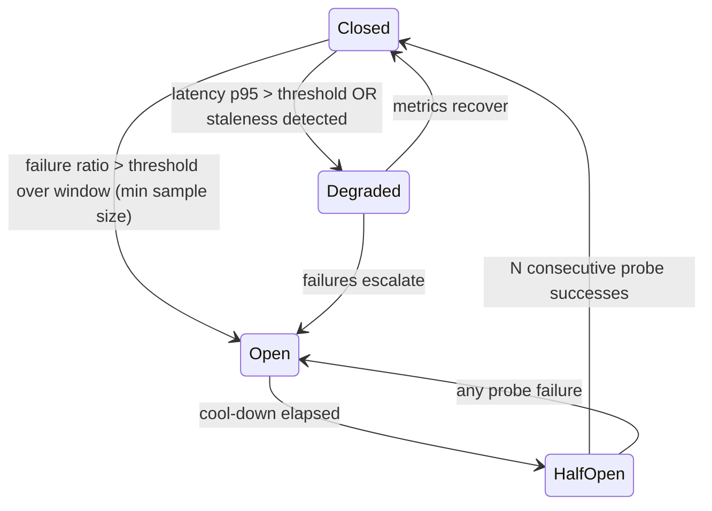

# Sentinel — RPC Provider Strategy

**Status: FROZEN (Phase 0). Implementation in Phase 3.**

> **Baseline requirement:** everything on the required path works against a single local validator with
> no API key. Multi-provider resilience is a capability, never a prerequisite.

---

## 1. The abstraction

```rust
/// One endpoint. Knows nothing about pools, failover, or policy.
#[async_trait]
trait RpcProvider: Send + Sync {
    fn id(&self) -> &ProviderId;
    fn capabilities(&self) -> &ProviderCapabilities;

    async fn call<R: RpcRequest>(&self, req: R, ctx: &CallContext) -> Result<R::Response, RpcError>;
}

/// A set of providers with health, policy, and selection. This is what callers use.
#[async_trait]
trait RpcPool: Send + Sync {
    async fn call<R: RpcRequest>(&self, req: R, class: RequestClass) -> Result<R::Response, RpcError>;

    /// Submission fans out rather than failing over (transaction-engine.md S-2).
    async fn broadcast(&self, tx: &[u8]) -> BroadcastOutcome;

    fn health(&self) -> Vec<ProviderHealth>;
}
```

`CallContext` carries the correlation ID, the deadline, the `RequestClass`, and the required
`minContextSlot`. **No call site constructs a raw HTTP request**; every request goes through the pool so
that budget, breaker, retry, and telemetry are impossible to bypass.

---

## 2. Why a Sentinel-owned trait rather than using the client crates directly

- **Crate churn is contained.** The Solana client crates have reorganized repeatedly across the
  2.x/3.x/4.x lines (`ecosystem-research.md` §7). A reorganization becomes a one-file change.
- **Provider quirks stay contained.** Different endpoints disagree about `getProgramAccounts` limits,
  rate-limit headers, and error shapes. Those differences belong in one adapter, not scattered.
- **Policy is unbypassable.** Budget, breaker, and correlation cannot be forgotten at a call site.
- **Tests get a real seam.** `FixtureProvider` and `FaultInjectingProvider` implement the same trait, so
  every failure-injection test drives real production code.

---

## 3. Capability discovery, not assumption

```rust
struct ProviderCapabilities {
    max_supported_transaction_version: u8,
    supports_get_program_accounts: bool,
    get_program_accounts_max_bytes: Option<usize>,
    max_blocks_per_get_blocks: u64,
    supports_min_context_slot: bool,
    supports_websocket: bool,
    supports_signature_subscribe: bool,
    supports_recent_prioritization_fees: bool,
    filters_vote_transactions: Option<bool>,
    reports_write_version: bool,          // Geyser yes, RPC no
    node_version: String,
}
```

Discovered at startup by probing (`getVersion`, plus a bounded probe per uncertain capability) and
re-probed on reconnect. A missing capability is an explicit `false`/`None` that the caller must handle —
**not** a runtime surprise mid-ingestion.

This directly serves research gate SR-7: if the local cluster lacks a method Sentinel requires, startup
fails loudly with the list, rather than degrading mysteriously hours later.

---

## 4. Request classes and budgets

| Class | Examples | Priority | Behavior under pressure |
|---|---|---|---|
| `Execution` | `simulateTransaction`, `sendTransaction`, `getLatestBlockhash`, `getSignatureStatuses` | **1 (highest)** | Never starved. Dedicated budget slice. |
| `RealtimeCompleteness` | `getBlock` at the head, `getBlocks` for the head window | 2 | Protected |
| `GapRepair` | `getBlock` for detected gaps | 3 | Yields to 1–2 |
| `Backfill` | historical `getBlock`, `getSignaturesForAddress` | 4 | Yields, and is expected to |
| `ScheduledScan` | `getProgramAccounts`, periodic snapshots | **5 (lowest)** | Starves first, by design |

Each provider carries a configured budget: max requests/second, max concurrent, and max in-flight bytes.
**The budget is enforced client-side before the request is made** — a 429 is treated as a bug in
Sentinel's own accounting, not as the normal way to discover a limit.

---

## 5. Retry, backoff, and failover

```
call(req, class):
  for attempt in 0..max_attempts(class):
      provider = select(class)                    # §5.1
      if provider is None: return Err(NoHealthyProvider)
      match provider.call(req, ctx.with_deadline(remaining)):
          Ok(r) if satisfies_context(r) => return Ok(r)     # §5.2
          Ok(r)                        => record_stale(provider); continue
          Err(e) if e.is_retryable()   => record_failure(provider, e)
                                          sleep(backoff_full_jitter(attempt))
                                          continue
          Err(e)                       => return Err(e)     # non-retryable: fail fast
  return Err(RetriesExhausted)
```

| # | Rule |
|---|---|
| RT-1 | Retries are **bounded per class**, and the whole call is bounded by a deadline. There is no unbounded retry anywhere. |
| RT-2 | Backoff is exponential with **full jitter**. Synchronized retries are how a degraded provider becomes an outage. |
| RT-3 | A retry may select a **different** provider. Retrying the same broken endpoint is a waiting loop, not a retry. |
| RT-4 | Non-retryable errors (invalid params, method not found, `-32015` missing `maxSupportedTransactionVersion`) **fail fast**. Retrying a bug wastes budget and hides it. |
| RT-5 | **`sendTransaction` never fails over — it fans out** (`transaction-engine.md` S-2). Duplicate broadcast of identical bytes is harmless; sequential failover adds latency for nothing. |
| RT-6 | Retry budgets are per-call *and* per-window. A provider whose error rate exceeds a threshold trips its breaker rather than absorbing retries indefinitely. |

### 5.1 Selection

Weighted by health, not round-robin: score = `f(success_rate, p95_latency, budget_headroom,
context_slot_freshness)`, with a small random tiebreak to avoid herding. A provider whose breaker is
open is excluded; one that is `Degraded` is used only for low-priority classes.

### 5.2 Freshness — `minContextSlot` is not optional

**A syntactically valid response from a node that is behind is worse than an error**, because it looks
like data. Every read that feeds canonical state:

- sends `minContextSlot` where the method supports it;
- checks the response's `context.slot` against the expected head and rejects it as `STALE`
  (`architecture.md` §9) if it is behind by more than a configured tolerance;
- counts staleness toward the provider's health.

Note the known ecosystem wrinkle: `context` and `minContextSlot` support is **not uniform across RPC
methods**, which is itself a reported source of indexer unreliability. `ProviderCapabilities` records
per-method support, and a method without it gets an explicit compensating check (compare against the
locally known head) rather than an assumption.

---

## 6. Circuit breaker



| # | Rule |
|---|---|
| CB-1 | The breaker requires a **minimum sample size**. Tripping on two failures during startup is a self-inflicted outage. |
| CB-2 | `Open` excludes the provider from **all** classes. `Degraded` excludes it from `Execution` and `RealtimeCompleteness` only. |
| CB-3 | Half-open probes are **cheap and read-only** (`getSlot`, `getHealth`) — never a submission and never an expensive scan. |
| CB-4 | **Content divergence trips the breaker immediately**, regardless of sample size. A provider returning different bytes for the same natural key is faulty or lying, and neither is something to average out (`ingestion-model.md` §10). |
| CB-5 | Every state change is a logged event with a metric and, on `Open`, an alert naming the provider and the reason. |
| CB-6 | **All providers open** is a distinct, loud state: ingestion pauses, execution refuses to build, the API reports `degraded`. It is never silently equivalent to "no work to do". |

---

## 7. Expensive-method policy

| Method | Policy |
|---|---|
| `getProgramAccounts` | `ScheduledScan` class only. Configured minimum interval. Never on a hot path. Never the sole source of any fact (`aegis-integration.md` §3.1). Paged where the provider supports it, with the page size from `capabilities`. |
| `getBlock` | Always with `maxSupportedTransactionVersion`, `transactionDetails: "full"`, `rewards: false` unless the reward stream is wanted. |
| `getBlocks` | Range-bounded by `max_blocks_per_get_blocks` from capabilities. |
| `getSignaturesForAddress` | Cold-start and targeted repair only; paged backwards with an explicit `until`. Never a completeness mechanism. |
| `getMultipleAccounts` | Batched to the provider's limit; the preferred snapshot mechanism over per-account reads. |
| `simulateTransaction` | `Execution` class; `sigVerify: false`, `replaceRecentBlockhash: false` (the real blockhash matters), and the result's compute units are recorded on the attempt. |
| `getRecentPrioritizationFees` | With the exact writable account set, never program IDs (`ecosystem-research.md` §6). |

---

## 8. WebSocket management

Covered in `ingestion-model.md` §4. The pool's responsibilities specifically:

- One connection per provider; a declarative subscription set re-applied on every connect.
- Reconnect with bounded exponential backoff and full jitter; reconnect attempts count toward the
  provider's health.
- Heartbeat derived from **observed slot cadence**, never a hardcoded interval.
- On repeated failure, the WebSocket fails over to another provider **independently of the HTTP path** —
  they are separate health domains, because a node can serve HTTP fine while its PubSub thread is
  saturated (a documented Agave behavior).

---

## 9. Observability

Every request carries a `request_id`, propagated into `raw_observations.request_id` so any stored byte
is traceable to the call that fetched it and the provider that served it.

Metrics per provider: request rate by class and method, error rate by class, timeout rate, rate-limit
events, p50/p95/p99 latency, breaker state, staleness rejections, divergence events, WebSocket
reconnects and uptime.

Alerts (each with a runbook in `observability.md` §5): all providers open; single provider open;
sustained rate limiting; divergence detected; staleness rate above threshold; WebSocket flapping.

---

## 10. Configuration

```toml
[[rpc.providers]]
id            = "local"
http          = "http://127.0.0.1:8899"
ws            = "ws://127.0.0.1:8900"
weight        = 100
max_rps       = 200
max_inflight  = 32
classes       = ["Execution","RealtimeCompleteness","GapRepair","Backfill","ScheduledScan"]
```

| # | Rule |
|---|---|
| CF-1 | **No default points at a network.** The shipped default is a single local provider. A missing configuration fails startup; it never silently falls back to a public endpoint. |
| CF-2 | Credentials are supplied by environment reference only (`${SENTINEL_RPC_X_TOKEN}`), never inline, and are **redacted in every log, metric label, error message, and stored `provider_id`**. |
| CF-3 | A provider may be restricted to a subset of classes — the honest way to use a rate-limited endpoint for backfill only. |
| CF-4 | Configuration is validated at startup against discovered capabilities. A provider that cannot serve a class it is configured for is a **startup error**, not a runtime surprise. |

---

## 11. Invariants

| ID | Invariant | Checked by |
|---|---|---|
| RPC-01 | No call site bypasses the pool | Architecture test / CI grep for direct client construction outside `sentinel-rpc` |
| RPC-02 | Every retry sequence is bounded in count and in total time | Property test |
| RPC-03 | A non-retryable error is never retried | Unit test per error class |
| RPC-04 | A response that fails the freshness check is never used as canonical | Failure-injection test with a lagging provider |
| RPC-05 | `sendTransaction` fans out and never fails over sequentially | Test |
| RPC-06 | An open breaker excludes the provider from every class | Test |
| RPC-07 | All-providers-open pauses ingestion and refuses execution, loudly | Failure-injection test |
| RPC-08 | Credentials never appear in logs, metrics, errors, or stored provider IDs | Log-scrubbing test + secret-scan in CI |
| RPC-09 | Every stored raw observation names the provider and request that produced it | Schema `NOT NULL` |
| RPC-10 | Every `getBlock`/`getTransaction` call sets `maxSupportedTransactionVersion` | CI grep + integration test against a v1-containing fixture |
