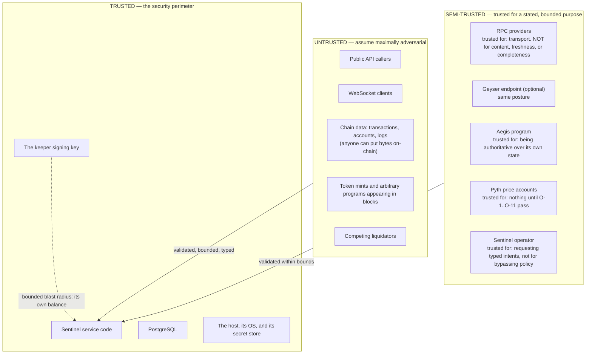

# Sentinel — Threat Model

**Status: FROZEN (Phase 0). New threats may be added; mitigations may not be weakened without an ADR.**

Format, matching Aegis's: **Asset at risk · Attacker · Entry point · Prerequisite · Impact · Mitigation
· Test · Residual risk.**

---

## 1. Trust boundaries

**Stated trust assumptions, in full:**

| Entity | Trusted for | NOT trusted for |
|---|---|---|
| RPC provider | Transporting a response | Its content, its freshness, its completeness, or agreeing with any other provider |
| Chain data | Being what the chain contains | Being well-formed, being decodable, being non-adversarial, or fitting any size expectation |
| Aegis program | Being the authority on Aegis state | Never changing — an upgrade is expected and handled (`aegis-integration.md` §8) |
| Pyth accounts | Nothing until every one of Aegis's O-1..O-11 checks passes | Anything, before that |
| API callers | Nothing | Anything |
| Operators | Requesting typed intents within policy | Bypassing the policy engine — there is no bypass (SK-10) |
| Keeper key | Signing what the policy engine allowed | Anything else; blast radius bounded to its own balance |
| PostgreSQL | Durability and isolation | — |

---

## 2. Threat catalogue

### S-01 — Malicious or faulty RPC data
- **Asset:** every derived value · **Attacker:** a compromised or buggy provider · **Entry:** any RPC response · **Prereq:** Sentinel uses that provider
- **Impact:** Fabricated balances, fabricated positions, fabricated health → wrong liquidations, wrong dashboards, wasted fees.
- **Mitigation:** Provider recorded on every raw row; cross-provider divergence detection with immediate breaker trip on content divergence (`ingestion-model.md` §10, CB-4); **the chain re-validates every action** — a fabricated liquidatable position simply fails on-chain; off-chain Aegis invariant checks catch impossible states.
- **Test:** `A-RPC-01` (lying provider fixture), FI-11.
- **Residual:** A **single-provider** deployment cannot detect divergence. Stated plainly: with one provider, Sentinel trusts it for content. Multi-provider is a configuration, and the degradation is documented rather than assumed away.

### S-02 — Provider disagreement / silent lag
- **Asset:** correctness of derived state · **Attacker:** environmental · **Entry:** any read · **Prereq:** a node behind or on a different fork
- **Impact:** Health computed from stale totals; missed or spurious liquidation candidates.
- **Mitigation:** `minContextSlot` on every canonical read; response `context.slot` checked against the known head; staleness counted toward provider health; the finalized chain resolves fork divergence (`rpc-strategy.md` §5.2).
- **Test:** FI-09, `A-RPC-02`.
- **Residual:** Methods without `context`/`minContextSlot` support fall back to a head comparison, which is weaker. Recorded per-method in `ProviderCapabilities`.

### S-03 — Malformed transaction or account crashes a worker
- **Asset:** platform liveness · **Attacker:** anyone who can land a transaction · **Entry:** normalization / decoding · **Prereq:** none — anyone can put arbitrary bytes on-chain
- **Impact:** A crash loop halts ingestion. **This is a real, cheap DoS on a naive indexer.**
- **Mitigation:** No `unwrap`/`expect`/`panic!`/unchecked indexing on any external-input path (clippy-enforced); every decode is fallible and produces a `decode_failures` row; size bounds before parsing; a committed corrupt-fixture corpus in CI.
- **Test:** FI-14, `A-PARSE-01..08`.
- **Residual:** None known. A new crash class becomes a permanent fixture in the corpus.

### S-04 — `getBlock` failing on unsupported transaction versions
- **Asset:** ingestion liveness · **Attacker:** environmental · **Entry:** historical fetch · **Prereq:** a v1 transaction in a block
- **Impact:** Error `-32015` on every block containing one → ingestion stalls, presenting as an inexplicable gap.
- **Mitigation:** Every fetch call site sets `maxSupportedTransactionVersion` (`ingestion-model.md` §3.2); CI grep; an integration test against a v1-containing fixture.
- **Test:** `A-VER-01`, RPC-10.
- **Residual:** Until SR-1 closes, the configured value may need to rise when v1 activates. Tracked as a gate, not left to discovery.

### S-05 — Decoder bug corrupts protocol state
- **Asset:** all derived state and every keeper decision · **Attacker:** none (own bug) · **Entry:** the Aegis adapter · **Prereq:** a layout or semantic error
- **Impact:** Systematically wrong health → wrong liquidations, or missed ones.
- **Mitigation:** Decoders are generated from an IDL or written against a pinned frozen spec — **never inferred** (`aegis-integration.md` §8.3); conformance vectors against Aegis's exact worked examples (§6.2); dual reconstruction (events vs snapshots) with divergence alerts; off-chain invariant checks; **the raw layer means a fix is retroactively applicable by replay**.
- **Test:** `AEGIS-CONF-01..06`, RP-08, projection-divergence test.
- **Residual:** A bug that corrupts both paths identically would evade the cross-check. The conformance vectors are the independent third check.

### S-06 — Forged protocol identity
- **Asset:** derived state · **Attacker:** anyone · **Entry:** decoding · **Prereq:** deploy a look-alike program or create a look-alike account
- **Impact:** A fake "market" appears in Sentinel with attacker-chosen parameters; the keeper acts on it.
- **Mitigation:** Every Aegis entity is validated on **program owner + discriminator + canonical PDA derivation**, all three; markets discovered from `MarketCreated` events emitted by the **configured program ID** and cross-checked against `getProgramAccounts` for that program; the signer's P-3 pins market and vaults against `aegis_markets` at signing time.
- **Test:** `A-IDENT-01` (look-alike program), `A-IDENT-02` (non-canonical bump), `A-IDENT-03` (right layout, wrong owner).
- **Residual:** None, given the configured program ID is correct. **Program-ID misconfiguration is an operational risk** mitigated by a startup assertion against the deployed program's data hash.

### S-07 — Stale chain state used for a decision
- **Asset:** transaction fees; protocol safety · **Attacker:** environmental · **Entry:** the keeper · **Prereq:** indexer lag
- **Impact:** Liquidations attempted against state that has moved; wasted fees; missed real opportunities.
- **Mitigation:** Every candidate carries `detected_at_slot`; the executor refuses beyond `max_staleness` and re-evaluates; lag beyond threshold **disables candidate creation entirely**; mandatory simulation immediately before signing (K-10).
- **Test:** FI-01, KP-13.
- **Residual:** A window equal to the simulate→land latency always exists. Bounded, measured, and priced into the fee budget.

### S-08 — Stale oracle interpretation
- **Asset:** correctness of every health value · **Attacker:** environmental or an adversary timing a price move · **Entry:** risk evaluation · **Prereq:** a price older than `max_price_age_secs`
- **Impact:** Health computed from a price Aegis would refuse → candidates that always fail, or a dashboard that says "healthy" when the protocol is fail-closed.
- **Mitigation:** All of O-1..O-11 applied at read time with the failing check recorded; `state = unknown_oracle` is a first-class value; the keeper's `price_deadline` pre-check (`keeper-design.md` §6).
- **Test:** `A-ORA-01..11` mirroring Aegis's own oracle suite against Sentinel's implementation.
- **Residual:** Sentinel cannot make a stale oracle fresh. A liquidatable-but-unactionable position is **recorded and surfaced**, which is Aegis's accepted residual T-21 made visible.

### S-09 — Duplicate execution of an economically sensitive action
- **Asset:** keeper funds · **Attacker:** none (own bug) or an adversary inducing retries · **Entry:** the execution engine · **Prereq:** a crash, a timeout, or a reorg
- **Impact:** Two liquidations for one opportunity; the second wastes a full repayment.
- **Mitigation:** `idempotency_key` UNIQUE; one non-terminal attempt per intent; **sign → persist → submit** ordering (FR-17); resubmission of **stored bytes** rather than re-signing; `lastValidBlockHeight` as the termination oracle; `UNKNOWN` never auto-retries.
- **Test:** FI-03, FI-04, FI-05, FI-17, FI-18, FI-19, KP-05, TX-01..TX-11.
- **Residual:** Bounded by the on-chain precondition — Aegis itself rejects a second liquidation of a now-healthy position. **Defense in depth: Sentinel's guarantee plus the chain's.**

### S-10 — Arbitrary transaction construction via the API
- **Asset:** the keeper key and everything it can reach · **Attacker:** any API caller · **Entry:** any endpoint · **Prereq:** an endpoint that accepts transaction bytes, instructions, or accounts
- **Impact:** The backend signs an attacker's transaction. **This is the single worst outcome in the system.**
- **Mitigation:** **No such endpoint exists.** `/tx/build` returns unsigned bytes; `/tx/track` accepts a signature, not bytes; the signer accepts only typed `SignRequest`s with a closed `intent_kind` enum and re-decodes the message itself; the policy engine has no bypass for anyone, including operators.
- **Test:** `A-SIGN-01` enumerates every route and asserts no bytes-in/signature-out path; `A-SIGN-02` injects a transfer into a planned message and asserts signing fails.
- **Residual:** None by construction. **Adding such a path requires an ADR that argues against `signer-and-key-management.md` §1.**

### S-11 — DoS via expensive decode or oversized input
- **Asset:** platform liveness · **Attacker:** anyone landing a transaction, or any API caller · **Entry:** decoding, API · **Prereq:** none
- **Impact:** CPU or memory exhaustion; ingestion stalls.
- **Mitigation:** Size bounds before parsing; bounded per-message work; no unbounded loops (CI-checked); bounded channels with drop-to-counting under pressure; API request-size limits, pagination caps, and query-complexity caps.
- **Test:** `A-DOS-01` (oversized account data), `A-DOS-02` (pathological log volume), `A-DOS-03` (API max-page abuse).
- **Residual:** A sustained high-volume attack degrades ingestion latency. Bounded, visible, and repaired by the gap scanner.

### S-12 — Compromised keeper key
- **Asset:** the keeper's own balance · **Attacker:** whoever obtains the key · **Entry:** host compromise, secret leak · **Prereq:** key access
- **Impact:** The attacker spends the keeper's SOL and loan-asset inventory. **They cannot touch user funds or Aegis vaults** — Aegis's `INV-ADM-01` and its permissionless design make that structurally impossible.
- **Mitigation:** Minimal funding; cold inventory topped up by an operator; policy engine; per-transaction/window/market caps; cluster genesis-hash binding; audit log; documented rotation.
- **Test:** `A-SIGN-05`, `A-SIGN-08`, KP-12.
- **Residual:** **Accepted and stated:** an autonomous keeper needs a hot key. The loss is bounded by its balance. This is Sentinel's analogue of Aegis's T-30 — the difference being that Sentinel's worst case is bounded and Aegis's is not.

### S-13 — Secret leakage
- **Asset:** RPC credentials, database credentials, the keeper key · **Attacker:** anyone reading logs, metrics, traces, or the repository · **Entry:** logging, error paths, telemetry, Git
- **Impact:** Provider abuse; database compromise; key theft.
- **Mitigation:** Redaction at the type level (secret values are a wrapper type whose `Debug`/`Display` prints a placeholder); no secret in Git enforced by `.gitignore` **and** a CI scanner; fixed-seed local keys, never committed files; a test that serializes a full config and asserts nothing sensitive appears.
- **Test:** `A-SEC-01` (config serialization), `A-SEC-02` (error paths), CI secret scan.
- **Residual:** Host compromise defeats this. Out of scope for application-layer mitigation, and said so.

### S-14 — API authorization failure
- **Asset:** user data; operator actions · **Attacker:** any caller · **Entry:** REST/WS · **Prereq:** a missing scope check
- **Impact:** Reading another user's data, or triggering an operator action.
- **Mitigation:** Authorization enforced at the **data-access layer**, not only at the route; scope carried on every query; operator credentials separate from read credentials; every operator action audited.
- **Test:** `A-API-01` (cross-user access on every user-scoped route), `A-API-02` (operator route without operator credential).
- **Residual:** None, given per-route test coverage — which is enforced by requiring one authorization test per user-scoped or operator route.

### S-15 — Replay of an authentication signature
- **Asset:** a user's session · **Attacker:** anyone observing a signature · **Entry:** wallet auth · **Prereq:** a captured signature
- **Impact:** Session hijack (read-only in v1; there is no user-scoped write).
- **Mitigation:** Single-use, short-lived, origin-bound nonce; short-lived token.
- **Test:** `A-SIGN-09`.
- **Residual:** Bounded by token lifetime; the blast radius is read access to data that is largely public anyway.

### S-16 — SQL injection
- **Asset:** the entire database · **Attacker:** any API caller · **Entry:** any query built from input · **Prereq:** string-concatenated SQL
- **Impact:** Total compromise.
- **Mitigation:** Parameterized queries everywhere; `sqlx` compile-time-checked queries in Rust; **no dynamic SQL from user input, ever** — sorting, filtering, and pagination map to a closed enum of allowed values; least-privilege roles limit the blast radius even if it happened.
- **Test:** `A-SQL-01` (injection corpus against every parameterized endpoint), CI grep for string-formatted SQL.
- **Residual:** None known.

### S-17 — WebSocket abuse
- **Asset:** platform liveness · **Attacker:** any client · **Entry:** the realtime API · **Prereq:** none
- **Impact:** Connection exhaustion; memory exhaustion from slow consumers; CPU from subscription churn.
- **Mitigation:** Connection caps per IP and per token; subscription caps per connection; bounded per-connection buffers with **slow-consumer disconnect**; subscription-rate limits; message size caps.
- **Test:** `A-WS-01` (connection flood), `A-WS-02` (slow consumer), FI-28.
- **Residual:** A distributed flood degrades availability. Mitigated at the edge, not in the application, and said so.

### S-18 — Rate-limit exhaustion against Sentinel's own providers
- **Asset:** ingestion and execution liveness · **Attacker:** an API caller triggering expensive paths, or Sentinel itself · **Entry:** any path that fans out to RPC · **Prereq:** an unbounded fan-out
- **Impact:** Provider budget exhausted; execution starved. **A liquidation missed because a dashboard query burned the budget is a real, embarrassing failure mode.**
- **Mitigation:** **No API request triggers an RPC call in v1** — the API reads Postgres only. Execution holds the top request-priority class with a dedicated budget slice. Client-side budgets enforced before requests.
- **Test:** `A-RPC-03` asserts no API route reaches the RPC pool; FI-21.
- **Residual:** None while the API stays read-only against Postgres. **Adding a pass-through RPC endpoint would reintroduce this and requires an ADR.**

### S-19 — SSRF via configuration or input
- **Asset:** internal network · **Attacker:** anyone who can influence a URL · **Entry:** provider configuration, any URL-taking field · **Prereq:** a URL from an untrusted source
- **Impact:** Requests to internal services.
- **Mitigation:** **URLs come only from configuration, never from user input or chain data.** No feature fetches a URL found in an account, a log, or a request. Configured endpoints are validated at startup (scheme allowlist, no loopback/link-local in non-local environments).
- **Test:** `A-SSRF-01` asserts no code path constructs an HTTP request from non-configuration data.
- **Residual:** None while that property holds; it is an architecture test, not a convention.

### S-20 — Dependency compromise
- **Asset:** everything · **Attacker:** an upstream maintainer or a registry attacker · **Entry:** the build · **Prereq:** a malicious release
- **Impact:** Full compromise, including key exfiltration.
- **Mitigation:** Lockfiles committed; `cargo-deny` / `npm audit` in CI; a minimal dependency surface with per-dependency justification (`AGENTS.md` §14); no build-time network access beyond the package registries; dependency updates are reviewed, not automatic.
- **Test:** CI advisory scan; a license/advisory gate that blocks.
- **Residual:** **Accepted and stated.** A sophisticated supply-chain attack is not defensible at this scale. Blast radius is reduced by the bounded keeper key (S-12).

### S-21 — Reorg-handling bug
- **Asset:** correctness of all derived state · **Attacker:** environmental · **Entry:** the chain-state engine · **Prereq:** a fork
- **Impact:** State reflecting a chain that no longer exists; duplicate or missed effects.
- **Mitigation:** Explicit canonical-chain model keyed `(slot, blockhash)`; rollback as a single transaction; **rebuild forward from a finalized anchor, never subtract**; execution rules for each fork/attempt interleaving (`finality-and-forks.md` §7).
- **Test:** FI-16 (depths 1, 5, 30), RP-06, CHN-01..CHN-10.
- **Residual:** A rollback deeper than the finalized anchor would be a chain-level failure beyond Sentinel's model. Alerted, and stated as out of scope.

### S-22 — Cache poisoning
- **Asset:** API responses · **Attacker:** any caller · **Entry:** HTTP caching / Redis fanout · **Prereq:** a cache key not including the scope
- **Impact:** A user sees another user's data, or stale data presented as current.
- **Mitigation:** **Sentinel does not cache authorization-dependent responses.** Public responses are cached with the scope and `as_of_slot` in the key; user-scoped responses are `no-store`. Redis holds only ephemeral hints and fanout, never authoritative values (ADR-0003).
- **Test:** `A-CACHE-01` (cross-scope cache key), `A-CACHE-02` (removing Redis changes no response body).
- **Residual:** None while Redis stays non-canonical — which FI-13 continuously verifies.

### S-23 — Poisoned queue job
- **Asset:** pipeline liveness · **Attacker:** anyone landing data that fails to process · **Entry:** the job queue · **Prereq:** a repeatedly-failing job
- **Impact:** A retry loop starves the queue.
- **Mitigation:** Bounded attempts → quarantine; quarantine never blocks other jobs; quarantine depth alerts (`distributed-correctness.md` §7).
- **Test:** FI-20.
- **Residual:** None. The failure is isolated to one unit of work.

### S-24 — Operator error
- **Asset:** derived state; keeper funds · **Attacker:** none · **Entry:** CLI, operator API · **Prereq:** a destructive command
- **Impact:** A truncated table, a mis-scoped replay, an unintended intent.
- **Mitigation:** No destructive command runs without an explicit scope — **no implicit "everything"**; `--dry-run` prints the plan; replay disables the keeper for its duration; every operator action is audited; nothing an operator can do bypasses the policy engine.
- **Test:** `A-OPS-01` asserts every destructive CLI path requires an explicit range or entity.
- **Residual:** An operator with database access can do anything. Bounded by role separation and audit, not eliminated.

### S-25 — Time-source manipulation / clock skew
- **Asset:** health computation; staleness decisions · **Attacker:** environmental · **Entry:** any use of wall-clock time · **Prereq:** host clock drift
- **Impact:** Wrong `t_eval` → systematically wrong health; wrong oracle staleness → acting on a price Aegis refuses.
- **Mitigation:** All chain-derived time comes from **block timestamps**; wall clock is used only for `t_eval` lookahead and lease expiry, both bounded and both compared against block time with a skew alarm; **no duration is derived from slot counts** (CI-NOSLOTTIME).
- **Test:** FI-23, DC-I-08.
- **Residual:** Extreme skew degrades keeper timing. Detected and alerted rather than silently absorbed.

---

## 3. Threats by asset

| Asset at risk | Threats |
|---|---|
| Keeper funds | S-09, S-10, S-12, S-13, S-24 |
| Correctness of derived state | S-01, S-02, S-05, S-06, S-07, S-08, S-21, S-25 |
| Platform liveness | S-03, S-04, S-11, S-17, S-18, S-23 |
| User data / privacy | S-14, S-15, S-16, S-22 |
| Credentials | S-13, S-20 |
| Internal network | S-19 |

---

## 4. Residual risks accepted for v1

Consolidated, so no reader has to infer them:

1. **S-01 single-provider trust** — with one provider configured, divergence is undetectable. Multi-provider is configuration; the degradation is documented.
2. **S-12 hot keeper key** — an autonomous keeper requires one. Loss is bounded by its balance and enforced caps.
3. **S-20 dependency compromise** — not defensible at this scale; blast radius reduced by S-12's bound.
4. **S-08 oracle staleness** — Sentinel cannot make a stale price fresh; unactionable positions are surfaced rather than hidden.
5. **S-11 / S-17 volumetric DoS** — degrades availability; mitigated at the edge, repaired by the gap scanner.
6. **S-24 operator with database access** — bounded by role separation and audit, not eliminated.
7. **S-21 rollback deeper than the finalized anchor** — a chain-level failure outside Sentinel's model; alerted.

**Sentinel is an off-chain system. It cannot cause a loss of user funds in Aegis** — Aegis's account
model makes that structurally impossible, and liquidation is permissionless. Sentinel's worst realistic
outcome is **spending its own keeper balance and reporting wrong numbers**, and every mitigation above
is calibrated to that honest scope.

---

## 5. Adversarial test campaign (Phase 12)

1. **Per-threat regression tests** — one named test per S-nn above, each of which must fail if its
   mitigation is removed.
2. **Corrupt-input corpus** — the committed malformed-payload fixture set, run against every decoder in
   CI. Every new crash class becomes a permanent fixture.
3. **Failure-injection suite** — the 28 entries of `distributed-correctness.md` §10, run in the nightly
   tier, with the crash-boundary tests (FI-03..05) also in the required tier.
4. **Duplicate-execution search** — a fuzz objective that randomly kills the executor across the full
   liquidation loop and asserts exactly one on-chain effect per intent.
5. **Policy-bypass search** — generated messages attempting to reach a signature through every planner
   path; all must be denied.
6. **Mutation check** — for each of the highest-severity mitigations (idempotency key, sign-before-
   submit ordering, policy checks P-3/P-9/P-12, `maxSupportedTransactionVersion`), remove the
   enforcement and confirm the corresponding test fails. **A mitigation whose test passes with the
   mitigation removed is not being tested.**
