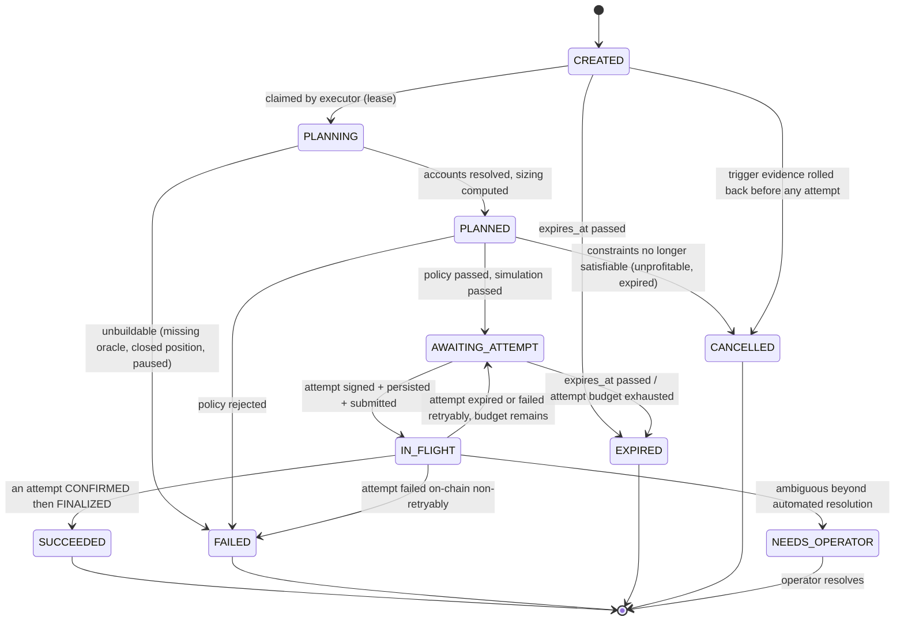
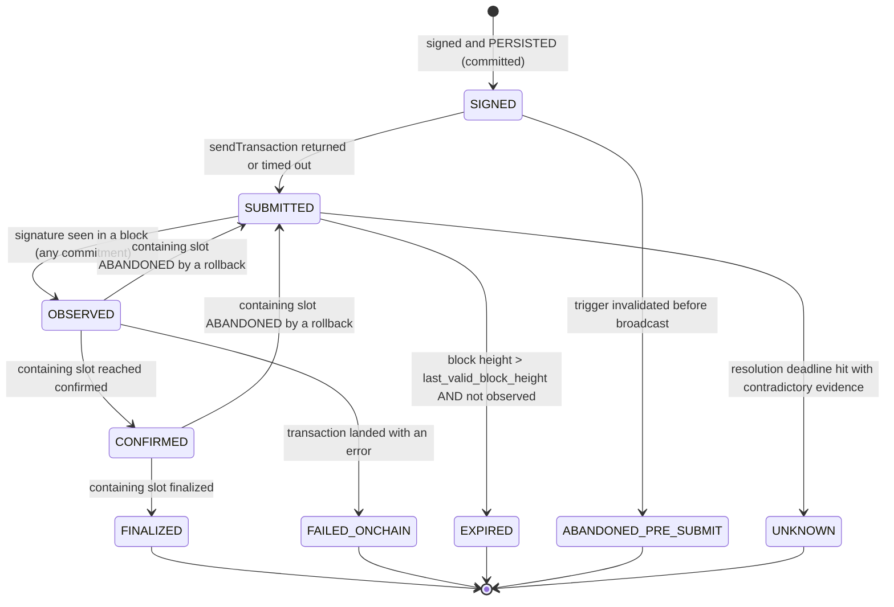

# Sentinel — Transaction Execution Engine

**Status: FROZEN (Phase 0). Implementation in Phase 10.**

> **The organizing decision:** *business intent* and *transaction attempt* are different objects with
> different lifetimes and different identities. Conflating them is exactly how an economically
> sensitive operation executes twice.

---

## 1. The two identities

| | **Execution intent** | **Transaction attempt** |
|---|---|---|
| Answers | "Should this business action happen, and did it?" | "What happened to these signed bytes?" |
| Identity | `idempotency_key` (business) | `signature` (chain) |
| Lifetime | Until succeeded, failed, expired, or cancelled | Until the blockhash expires or the transaction finalizes |
| Cardinality | 1 | 0..N per intent |
| Created by | `sentinel-risk` (Rust) or an operator action | `sentinel-executor` (TS) |
| Rebuildable by replay? | **No** | **No** |

A retry, a fee escalation, a blockhash refresh, and an RPC failover all produce a **new attempt** for
the **same intent**. Nothing about that changes whether the business action is allowed to happen again.

---

## 2. Intent state machine



### 2.1 Rules

| # | Rule |
|---|---|
| I-1 | **At most one attempt is in flight per intent at any time.** Enforced by the intent lease plus a partial unique index over `transaction_attempts` in a non-terminal state per `intent_id`. |
| I-2 | An intent moves to a terminal state exactly once. Terminal states never transition. |
| I-3 | `expires_at` is **mandatory** at creation. An intent with no expiry is a standing instruction to spend money. |
| I-4 | `max_attempts` and `cumulative_fee_lamports` ceiling are **mandatory**. Both are checked before every new attempt. |
| I-5 | `NEEDS_OPERATOR` is a real terminal-for-automation state, not a synonym for failed. It means the automated resolver could not prove what happened, and a human must look. It always alerts. |
| I-6 | Every transition writes `updated_at` and a reason. The transition log is the audit trail. |
| I-7 | An intent is never re-created for the same `idempotency_key`. A second insert conflicts, and the conflict is a **success**, not an error (`architecture.md` §9, CONFLICT class). |

---

## 3. Attempt state machine



The two `→ SUBMITTED` back-edges are the subtle part: a Solana transaction is bound to its **blockhash**,
not to a fork. If the block containing it is abandoned, the transaction may still land in a later block
while its blockhash remains valid. Treating a reorg as terminal failure would be wrong in the dangerous
direction — it would invite a duplicate. Each has a dedicated failure-injection test.

---

## 4. Lifecycle stages in detail

### 4.1 CREATED → PLANNING (claim)

```sql
UPDATE execution_intents
   SET state='PLANNING', lease_holder=$worker, lease_expires_at=now()+$lease_ttl
 WHERE intent_id = (
   SELECT intent_id FROM execution_intents
    WHERE state IN ('CREATED','AWAITING_ATTEMPT')
      AND (lease_expires_at IS NULL OR lease_expires_at < now())
      AND expires_at > now()
    ORDER BY priority, created_at
    FOR UPDATE SKIP LOCKED LIMIT 1)
RETURNING *;
```

The lease TTL is short and **renewed** during long operations. A crashed worker's lease expires and the
intent is re-claimed — safely, because every subsequent step is idempotent and because the attempt row
records exactly how far the previous holder got.

### 4.2 PLANNING (build)

1. **Re-read state.** Every input is re-read at claim time: market params (versioned), position,
   pause bits, market totals. The candidate that created the intent may be seconds old.
2. **Re-evaluate the precondition** at `t_eval = now + expected_landing_latency`
   (`aegis-integration.md` §5.1, H-1). If the position is no longer liquidatable → `CANCELLED`, class
   `RACE_HEALED`. This is normal and is not an error.
3. **Resolve the oracle accounts.** Pick the freshest valid `PriceUpdateV2` per feed; compute
   `price_deadline = publish_time + max_price_age_secs`; if `now + expected_landing_latency >
   price_deadline − safety_margin` → cannot build (§4.6 of `keeper-design.md`).
4. **Size the action.** `max_repay` from close factor, `full_liq_hf`, and the dust rule
   (`aegis/economic-model.md` §7.1); expected seizure, bonus, and protocol cut from §7.2–7.3.
5. **Build the instruction** using `@aegis/sdk`'s builder — never a hand-assembled account list
   (`architecture.md` §3.2).
6. **Resolve the account set** and record it; it is the input to the policy check.

### 4.3 PLANNED (simulate, then policy, then sign)

Order matters and is fixed:

```
simulate  →  policy check  →  sign  →  persist  →  submit
```

- **Simulation is mandatory** and is never skipped for latency. It provides the real compute-unit
  figure, catches a stale precondition, and surfaces the Aegis error code *before* any fee is spent.
- **Simulation failure is not retried blindly.** The returned error is classified per
  `aegis-integration.md` §12; a `MODEL_DIVERGENCE` or `ACCOUNT_REJECTED` class **pauses the keeper**.
- **The policy check runs on the exact bytes that will be signed** (`signer-and-key-management.md` §4),
  after simulation, so it validates the final message and not an earlier draft.

### 4.4 Compute budget and fees

| Input | Source | Rule |
|---|---|---|
| Compute unit limit | Simulation's `unitsConsumed` × configured margin, clamped to a ceiling | Never a hardcoded 200k or 1.4M. Under-setting fails the transaction; over-setting wastes fee and can hurt scheduling. |
| Priority fee | `getRecentPrioritizationFees` over **the exact writable account set** (market, both vaults, position), clamped to `[floor, ceiling]`, escalated per attempt | Never pass program IDs — they produce meaningless samples (`ecosystem-research.md` §6). |
| Fee escalation | Multiplicative per attempt, bounded by the intent's `cumulative_fee_lamports` ceiling | An unbounded escalation ladder is how a keeper burns its budget on an unwinnable race. |
| Encoding | **v0** transactions with `ComputeBudget` instructions today; the v1 `transactionConfig` path when the cluster activates it | Aegis's `liquidate` uses 14 accounts + program and fits a legacy transaction (`INV-RES-06`), so no ALT and no v1 is required. |

### 4.5 Address lookup tables

**Sentinel does not use ALTs.** Aegis's own `INV-RES-06` states every instruction fits a legacy
1232-byte transaction without one, and transaction v1 removes ALTs entirely. Using an ALT to solve a
problem Sentinel does not have would be padding. Sentinel must nonetheless *decode* v0 transactions
that reference ALTs, because other people's transactions do.

### 4.6 Durable nonces — considered and rejected for v1

A durable nonce replaces the recent blockhash with an on-chain nonce account, removing the ~150-block
expiry window. It genuinely solves "the transaction expired before it landed."

**Rejected for v1**, with the reasoning recorded rather than the conclusion:

- **The expiry window is Sentinel's safety net.** `lastValidBlockHeight` is what makes "this attempt
  definitively never landed" a *provable* statement (§8). A durable nonce makes a signed transaction
  valid indefinitely, which converts a bounded ambiguity into an unbounded one — and unbounded
  ambiguity around a value-moving transaction is precisely the hazard this engine exists to prevent.
- Liquidation is **latency-sensitive and self-invalidating**: if it did not land in the blockhash
  window, the opportunity is almost certainly gone and re-planning is more correct than re-broadcasting
  a stale sizing.
- A nonce account is shared mutable state that must be advanced in every transaction, which serializes
  the keeper and adds an account to every message.

**When a durable nonce would be right**, recorded as the adoption trigger: an operation that is *not*
time-sensitive and *must* eventually happen (e.g. an operator-initiated `absorb_bad_debt`, or offline
signing with a hardware key). If such an operation enters Sentinel, a durable nonce becomes the correct
mechanism for it specifically and requires an ADR.

---

## 5. Transaction versions

| Version | Sentinel builds | Sentinel decodes | Notes |
|---|---|---|---|
| legacy | No | **Yes** | Still common |
| v0 | **Yes** | **Yes** | The build target; ALT support decoded but never used |
| v1 | Not until activated and verified (SR-1) | **Yes, mandatory** | 4096 bytes, 64 accounts, no ALTs, priority fee and compute budget in `transactionConfig` |

Decoding rules that are easy to get wrong and therefore have tests:
- Every `getBlock`/`getTransaction` call sets `maxSupportedTransactionVersion` (else -32015).
- Priority fee is read from `transactionConfig` for v1 and from `ComputeBudget` instructions otherwise,
  and `priority_fee_source` records which (`data-model.md` §3).
- The v1 priority fee is an **absolute lamport total**; the legacy/v0 fee is
  `ceil(micro_lamports_per_cu × cu_limit / 1e6)`. Storing them without the discriminator corrupts every
  fee metric.

---

## 6. The crash-safety ordering — FR-17

**This is the most important paragraph in this document.**

```
1.  build            (no side effect)
2.  simulate         (no side effect)
3.  policy check     (no side effect)
4.  sign             (no side effect — the signature exists only in memory)
5.  PERSIST + COMMIT (signature, transaction_bytes, blockhash, last_valid_block_height, state=SIGNED)
6.  submit           (the only side effect)
7.  update           (state=SUBMITTED, submitted_at)
```

**The commit at step 5 happens before the side effect at step 6.** Therefore:

| Crash point | State on restart | Recovery |
|---|---|---|
| Before 5 | No attempt row exists | Re-plan from scratch. Nothing was broadcast. Safe. |
| Between 5 and 6 | Attempt row is `SIGNED` | **Resubmit the stored bytes verbatim.** Identical bytes produce an identical signature; a duplicate broadcast of the same signature is a no-op on-chain. Safe. |
| Between 6 and 7 | Attempt row is `SIGNED`, transaction possibly broadcast | Same as above — resubmit the same bytes. Still safe, for the same reason. |
| After 7 | Attempt row is `SUBMITTED` | Resolve per §8. |

**The dangerous state — "something was submitted and Sentinel does not know what" — is unreachable**,
because the bytes and the signature are durable before broadcast. This is why `transaction_bytes` is
stored and not merely the signature: resubmitting *the same bytes* is idempotent, whereas re-signing
would produce a new signature and a genuine duplicate.

**Corollary rule:** a signed transaction is **never** built and submitted in one uncommitted unit of
work, and the persistence is **never** deferred to "after we know it worked."

---

## 7. Submission

| # | Rule |
|---|---|
| S-1 | Submit with `skipPreflight: true` — simulation already ran, deliberately, at step 2, and preflight adds latency and a second failure mode. |
| S-2 | Submit to **multiple providers** concurrently. Duplicate broadcast of identical bytes is harmless and materially improves landing odds. |
| S-3 | A submission timeout or a connection error is **not** evidence of non-submission. It moves the attempt to `SUBMITTED` and hands it to the resolver. Treating a timeout as "did not send" is how duplicates happen. |
| S-4 | Rebroadcast the same bytes on a bounded schedule until `lastValidBlockHeight` passes. Rebroadcast is idempotent by construction. |
| S-5 | Never create a second attempt while the first has not expired. |

S-3 deserves emphasis: **an RPC error on `sendTransaction` tells you nothing about whether the
transaction reached the network.** The only correct response is to record it as possibly-in-flight and
resolve it by observation.

---

## 8. Resolution of ambiguous outcomes

Every attempt reaches a terminal state through evidence, never through a timer alone.

```
resolve(attempt):
  1. Was the signature observed in a canonical block?
       -> yes: OBSERVED. Success/failure from meta.err. Promote with the slot's commitment.
  2. Has current block height exceeded last_valid_block_height?
       -> no:  keep polling / rebroadcasting. Not yet resolvable.
       -> yes: the transaction can NEVER land with this blockhash.
               Confirm absence at `finalized` across >= 2 providers.
               -> absent:      EXPIRED  (definitively never landed)
               -> present:     OBSERVED (a late observation; use it)
               -> disagreement: UNKNOWN -> NEEDS_OPERATOR
```

**`lastValidBlockHeight` is the entire basis of termination.** It is a *block-height* bound, not a slot
or time bound, so it stays correct as slot durations change (`ecosystem-research.md` §1.5) and under
Alpenglow. Nothing in this engine may substitute a wall-clock timeout for it.

Sources of observation, in preference order:
1. **Sentinel's own ingestion pipeline** — the signature appearing in an ingested block. This is the
   strongest evidence because it is the same data everything else is derived from.
2. `getSignatureStatuses` polled with bounded frequency.
3. `signatureSubscribe` as a latency hint only, never as sole evidence.

**Rule:** the executor prefers its own indexer over a direct RPC status query, because that makes the
execution record and the chain record consistent by construction. A status query that disagrees with
the ingestion pipeline is a divergence to investigate, not a value to prefer.

---

## 9. Retry policy

| Failure | Retry? | New attempt? | Notes |
|---|---|---|---|
| Build failed (missing oracle, closed position) | No | No | `FAILED` or `CANCELLED` with reason |
| Simulation failed — `RACE_HEALED` | No | No | `CANCELLED`. Normal. |
| Simulation failed — `MODEL_DIVERGENCE` / `ACCOUNT_REJECTED` | **No** | No | `NEEDS_OPERATOR` + **pause the keeper**. Sentinel is wrong. |
| Policy rejected | **No** | **Never** | `FAILED`. Retrying a policy violation is how a bug becomes an incident. |
| `sendTransaction` transport error | Yes | **No** — resubmit the same bytes | The signature is already durable |
| Attempt `EXPIRED` (blockhash) | Yes, if budget remains | **Yes** — re-plan and re-sign | Re-plan is mandatory; never re-sign stale sizing |
| Attempt `FAILED_ONCHAIN`, retryable band (oracle stale, race) | Yes, if budget remains | Yes | Fee escalation applies |
| Attempt `FAILED_ONCHAIN`, non-retryable band (config, policy, size) | No | No | `FAILED` + reconciliation row |
| `UNKNOWN` | No | **No** | `NEEDS_OPERATOR`. Creating another attempt under genuine ambiguity is the one thing this engine exists to prevent. |

Every retry decision is bounded by three independent budgets: `max_attempts`, `cumulative_fee_lamports`,
and `expires_at`. Exhausting any one terminates the intent.

---

## 10. Provider failover during execution

Execution is the **highest** request-priority class (`ingestion-model.md` §13). It is never starved by
backfill.

- Build/simulate/status calls fail over per `rpc-strategy.md` §5.
- **Submission does not fail over — it fans out** (S-2).
- A provider that returns a stale `getLatestBlockhash` (detectable via `minContextSlot`) is excluded
  from blockhash acquisition specifically, because a stale blockhash shortens the landing window
  invisibly.

---

## 11. Invariants

| ID | Invariant | Checked by |
|---|---|---|
| TX-01 | An intent's `idempotency_key` is globally unique | Unique index + duplicate-creation test |
| TX-02 | At most one non-terminal attempt exists per intent | Partial unique index + concurrency test |
| TX-03 | Every attempt's signature and bytes are committed before any submission | **Crash-injection test at the exact boundary** |
| TX-04 | Resubmitting stored bytes never produces a different signature | Property test |
| TX-05 | An attempt reaches a terminal state only via observation or `lastValidBlockHeight` expiry, never via a wall-clock timeout | State-machine property test |
| TX-06 | No terminal state ever transitions | State-machine property test over random sequences |
| TX-07 | Every signed transaction passed the policy check on its final bytes | Policy test + audit-log assertion |
| TX-08 | Every signed transaction was simulated immediately before signing | Test asserting the ordering |
| TX-09 | A rollback of an observed attempt returns it to `SUBMITTED` and never creates a duplicate intent | Fork failure-injection test |
| TX-10 | Total fees spent per intent never exceed its ceiling | Property test |
| TX-11 | An `UNKNOWN` attempt never triggers an automatic new attempt | State-machine test |
| TX-12 | No code path signs bytes that did not originate from a typed intent in this process | Architecture test + code review checklist |
